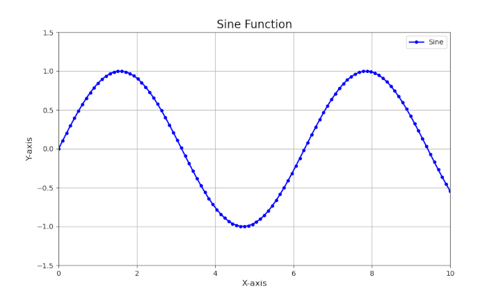

:::card[example]
### Core Imports
```python
import numpy as np
import scipy.stats as stats
import scipy.linalg as la
import scipy.integrate as integrate
import matplotlib.pyplot as plt
```
::::

:::card[section]
### Jupyter Notebooks

---

#### Installation & Launching

Install Jupyter using pip:

```bash
pip install notebook
```

Launch it from your project folder:

```bash
jupyter notebook
```

---

#### Essential Shortcuts (Command Mode)

> Press `Esc` to enter Command Mode (the cell border turns blue).

| Shortcut        | Action                                     |
| --------------- | ------------------------------------------ |
| `Shift + Enter` | Run current cell and select the one below. |
| `Ctrl + Enter`  | Run selected cell(s) without moving.       |
| `A` / `B`       | Insert a new cell Above / Below.           |
| `M` / `Y`       | Convert cell to **Markdown** / **Code**.   |
| `D, D` (twice)  | Delete the selected cell.                  |

---

#### Useful “Magic” Commands

| Command                | Description                                                    |
| ---------------------- | -------------------------------------------------------------- |
| `%matplotlib inline`   | Display Matplotlib plots inline within the notebook.           |
| `%timeit my_func()`    | Measure the average execution time of a function or statement. |
| `!pip install library` | Run shell commands directly (e.g., install a Python package).  |

::::

:::card[section]
### NumPy: Arrays

#### Creating Arrays

| Function                         | Description                                      |
| -------------------------------- | ------------------------------------------------ |
| `np.array([[1,2],[3,4]])`        | Create a 2-D array.                              |
| `np.zeros(s)`, `np.ones(s)`      | Create array of zeros / ones with shape `s`.     |
| `np.arange(start, stop, step)`   | Array of evenly spaced values.                   |
| `np.linspace(start, stop, num)`  | Array of `num` evenly spaced values.             |
| `np.identity(n)`, `np.eye(n, k)` | Create an *n × n* identity matrix.               |
| `np.diag(v)`                     | Create a square matrix with `v` on the diagonal. |

---

#### Array Indexing & Slicing

```python
arr = np.arange(10)      # [0, 1, ..., 9]
arr[2:5]                 # elements 2‒4  -> [2, 3, 4]
arr[arr > 5]             # boolean mask  -> [6, 7, 8, 9]

# 2-D indexing (matrix)
mat = np.array([[1, 2, 3],
                [4, 5, 6]])
mat[1, 2]   # row 1, col 2 -> 6
mat[:, 1]   # all rows, col 1 -> [2, 5]
```
::::

:::card[section]
### Probability & Randomness

#### Random Number Generation (`np.random`)

| Function                             | Description                                                                                          |
| ------------------------------------ | ---------------------------------------------------------------------------------------------------- |
| `np.random.rand(d0, d1)`             | Generate random floats in the interval $\[0, 1)\$ with shape `(d0, d1)`.                             |
| `np.random.randn(d0, d1)`            | Generate samples from the standard normal distribution (mean 0, std 1) with shape `(d0, d1)`.        |
| `np.random.randint(lo, hi, size)`    | Generate random integers from `lo` (inclusive) to `hi` (exclusive), with the specified shape `size`. |
| `np.random.choice(a, size, replace)` | Draw `size` random samples from array `a`. Set `replace=True` to sample with replacement.            |
| `np.random.seed(n)`                  | Set the random seed to `n` for reproducible results.                                                 |

**Example:**

```python
np.random.randn(2, 3)
# Example output:
# array([[ 1.03, -0.58,  0.00],
#        [-1.34,  0.91,  0.17]])
```

---

#### Probability Distributions (`scipy.stats`)

Use `dist.method()` where `method` can be:

* `rvs`: draw random samples
* `pdf`: probability density function (for continuous distributions)
* `pmf`: probability mass function (for discrete distributions)
* `cdf`: cumulative distribution function
* `ppf`: inverse of `cdf` (percent point function)

| Distribution | SciPy Object    |
| ------------ | --------------- |
| Normal       | `stats.norm`    |
| Binomial     | `stats.binom`   |
| Poisson      | `stats.poisson` |
| Uniform      | `stats.uniform` |

**Example:**

```python
from scipy.stats import norm

# Draw samples, compute PDF and CDF
samples = norm.rvs(loc=0, scale=1, size=1000)
prob_density = norm.pdf(0)
cum_prob = norm.cdf(1.96)
```
::::

:::card[section]
### Statistics (`scipy.stats`)

---

#### Descriptive Statistics

| Function                               | Description                                                                        |
| -------------------------------------- | ---------------------------------------------------------------------------------- |
| `arr.mean()`, `arr.std()`, `arr.var()` | Compute the **mean**, **standard deviation**, and **variance** of the array.       |
| `np.median(arr)`                       | Compute the **median** (middle value) of the array.                                |
| `np.percentile(arr, q)`                | Compute the **q-th percentile** (e.g., `q=50` gives the median).                   |
| `stats.describe(arr)`                  | Get a full descriptive summary: size, min/max, mean, variance, skewness, kurtosis. |

**Example:**

```python
arr = np.array([1, 2, 3, 4, 5])

np.mean(arr)           # → 3.0
np.percentile(arr, 50) # → 3.0 (median)
stats.describe(arr)    # → count=5, min=1, max=5, mean=3.0, ...
```

---

#### Statistical Hypothesis Tests

> Most tests return a tuple: `(test_statistic, p_value)`. The **p-value** tells you how likely the result is under the null hypothesis.

| Test               | Function                   | Use Case                                               |
| ------------------ | -------------------------- | ------------------------------------------------------ |
| One-Sample T-Test  | `stats.ttest_1samp()`      | Test if a sample’s mean differs from a known value.    |
| Independent T-Test | `stats.ttest_ind()`        | Compare means of **two independent groups**.           |
| ANOVA              | `stats.f_oneway()`         | Compare means across **three or more groups**.         |
| Chi-Square Test    | `stats.chi2_contingency()` | Test if two **categorical variables** are related.     |
| Shapiro-Wilk Test  | `stats.shapiro()`          | Test if a sample comes from a **normal distribution**. |

**Example:**

```python
# Is the mean significantly different from 0?
from scipy import stats
sample = [2.3, 2.5, 1.8, 2.0]
stats.ttest_1samp(sample, popmean=0)
# → returns statistic and p-value
```
::::

:::card[section]
### Linear Algebra (`scipy.linalg`)

> SciPy’s `scipy.linalg` module is preferred over NumPy’s `np.linalg` for more advanced or numerically stable linear algebra operations.

---

#### Core Functions

| Operation                              | Function    | Description                                                         |
| -------------------------------------- | ----------- | ------------------------------------------------------------------- |
| **Inverse**                            | `la.inv(A)` | Computes the inverse of a square matrix `A`.                        |
| **Determinant**                        | `la.det(A)` | Computes the determinant of matrix `A`.                             |
| **Eigenvalues & Eigenvectors**         | `la.eig(A)` | Returns eigenvalues and right eigenvectors of a square matrix.      |
| **Singular Value Decomposition (SVD)** | `la.svd(A)` | Factorizes `A` into singular values and vectors: `U Σ V^T`.         |
| **LU Decomposition**                   | `la.lu(A)`  | Decomposes `A` into `P @ L @ U`, where `P` is a permutation matrix. |

---

#### Solving Linear Systems

To solve the system of equations $Ax = b$:

```python
import numpy as np
from scipy import linalg as la

A = np.array([[3, 1],
              [1, 2]])
b = np.array([9, 8])

x = la.solve(A, b)
# Returns: array([2., 3.])
```

* This solves for `x` such that `A @ x == b`.
* More efficient and numerically stable than computing `inv(A) @ b`.

::::

:::card[section]
### Visualization (`matplotlib.pyplot`)

---

#### Plotting Workflow & Customization

```python
import numpy as np
import matplotlib.pyplot as plt

# 1. Prepare data
x = np.linspace(0, 10, 100)
y = np.sin(x)

# 2. Create a figure
plt.figure(figsize=(10, 6))

# 3. Plot the data
plt.plot(x, y,
         color='blue',        # Line color
         linestyle='-',       # Line style
         linewidth=2,         # Line width
         marker='o',          # Marker type
         markersize=4,        # Marker size
         label='Sine')        # Legend label

# 4. Customize the plot
plt.title('Sine Function', fontsize=16)
plt.xlabel('X-axis', fontsize=12)
plt.ylabel('Y-axis', fontsize=12)
plt.legend(fontsize=10)
plt.grid(True)
plt.xlim(0, 10)
plt.ylim(-1.5, 1.5)

# 5. Show or save the plot
plt.savefig('my_plot.png', dpi=300)  # Save as high-res image
plt.show()                           # Display in notebook or GUI
```

 

::::