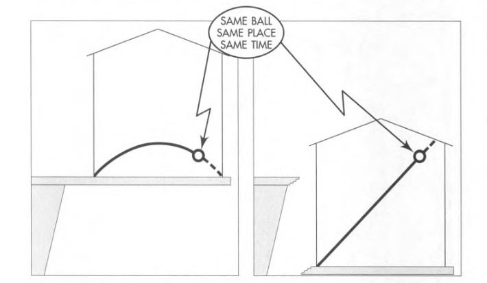
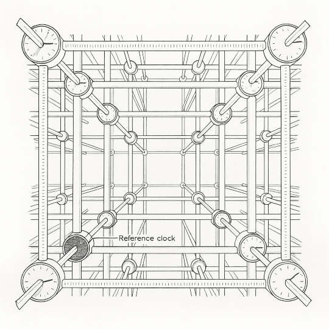

# Spacetime Physics, Chapter 2

### 2.2 The Intertial (Free-Float) Frame

Einstein's revolutionary idea: **Eliminate gravity!** (locally, using free-float frames)

 

The same ball thrown in the same direction with the same speed.

- Left: Observer with a floor pushing up against their feet.
- Right: Observer in free fall (free-float).

In both descriptions, the ball arrives at the same place -- relative to earth -- at the same time.

If we are in a **free-float frame**, the ball has straight-line motion.

Even when the room was not cut away from the cliff, the floor did not affect the
midair flight of the ball. But the floor did affect us who watched the motion.

**What happens when we let go of a pencil?**

It remains at rest -- as observed by the free-float frame!

The question is: "Before I let go, why must I apply an upward force to keep the pencil
at rest?"

Answer: Because we are making observations from an unnatural frame: one held fixed
at the surface of the earth.

### 2.3 Local Character of Free-Float Frames

A reference frame is called **Inertial** or **free-float** or **Lorentz** frame ...

- ... in a certain region of space and time
- ... when throughout that region and within some specified accuracy:
   - every free test particle initially at rest with respect to the frame remains at rest
   - every free test particle initially in motion with respect to the frame remains in
     motion without change of speed or direction. 

A free float frame is "local" in the following senses:

- It is limited in space and time.
- Its free-float character can be determined within, locally.

Newton's first law is the "Law of Inertia". For Newton, **inertia** was a property of
objects that described their tendency to maintain their state of motion.

Here, we have turned the "law of inertia" around. Before we certify a frame as
inertial, we _require_ observers in that frame to demonstrate that every free
particle behaves inertially.

Therefore, Newton's first law _defines_ a reference frame in which one can study
the motion of particles.

### 2.4 Regions of Spacetime

Regions of spacetime are four-dimensional: three space dimensions and one time dimension.

For some experiments, local free-float frames aren't enough.

For example, particles traveling near a comet get nearer or farther due to tidal
forces from Sun. A frame large enough to include these particles is not free-float.

Reducing the spatial size of the frame until relative motion is not detectable is very
small compared to the size of the head of the comet. We cannot analyze the motion of
the comet with a frame smaller than the comet itself.

Instead, we can think of a larger frame with limited time. In this way, motion of
the comet over a small portion of its trajectory can be analyzed using Special Relativity.

However, questions about the entire trajectory cannot be answered using a single
free-float frame. For this, we require a series of frames.

**General Relativity** -- the theory of gravitation -- tells how to describe and
predict orbits that traverse a string of adjacent free-float frames. Only general
relativity can describe motion in unlimited regions of spacetime.

### 2.5 Test Particle

A **test particle** is a particle whose mass is so small, within some specified accuracy,
that its presence does not affect the motion of other nearby particles.

Free-float frame is definable because every substance falls with the same acceleration.

A frame that is free-float for a test particle of a one kind is free-float for test particles
of all kinds.

### 2.6 Locating Events with a Latticework of Clocks

How can we determine the place and time at which an event occurs in a given free-float frame?

Think of a lattice of sticks with clocks at their intersections. Clocks are identical and read
time in meters.

 

We want the clocks to be **synchronized**. How?

Pick one clock and call it the **reference clock**, with its pointer initially at zero.
At this instant let it send out a flash of light spreading in all directions. Call the flash
emisision the **reference event**, and the spreading spherical wave the **reference wave**.

When the reference wave arrives at another clock 5 meters away, we want that clock to read 5 meters.

So, we set all clocks to the distance from the reference clock, and release them when the reference
flash arrives.

When all clocks are released, the lattice clocks are said to be **synchronized**.

**Locating an event with latticework**

The space portion of the event is taken to be the location of the clock nearest the event.
The time portion of the event is taken to be the reading of that clock at the instant the event occurs.

### 2.7 Observer

In relativity, we often talk about the **observer**. Where is the observer?

It is a shorthand way of speaking about **the whole collection of recording clocks** associated
with one free-float frame.

Location and time of each event is recorded by the clock nearest the event.

### 2.8 Measuring Particle Speed

We can record the events along the path of a particle using the latticework of clocks.
Distances between locations of successive events and time lapse between them reveal
the particle's speed.

Particle speed in meters per meter is the ratio of its speed to the speed of light.

Let $v_\text{conv}$ be the velocity in conventional units (meters per second), and
let $c$ be the speed of light in the same conventional units. Then:

$$
v = \frac{v_\text{conv}}{c}
$$

From the motion of test particles we can determine if the latticework constitutes a free-float frame.

- If -- within some specified accuracy -- a test particle moves in a straight line,
- The calculated speed is constant,
- The same results are true for as many test particles as we try.

### 2.9 Rocket Frame

Any frame moving at constant velocity with respect to a free-float frame is also a free-float frame.
There's nothing unique about any of these frames as long as each of them is free-float.

All free-float (inertial) frames are equivalent arenas in which to carry out physics experiments.

