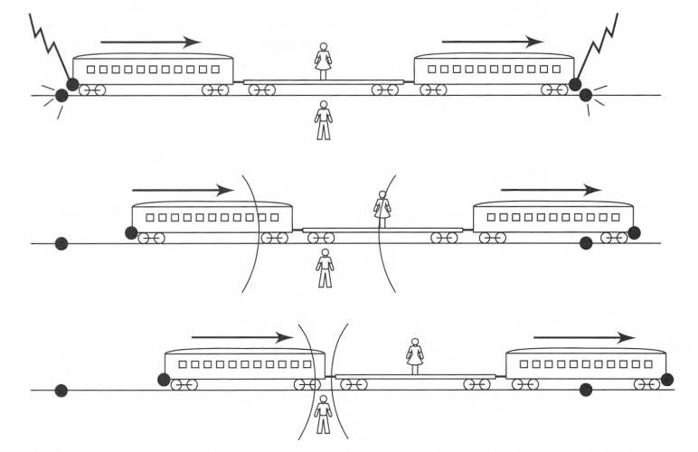
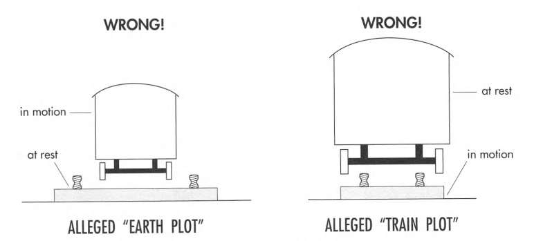
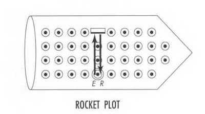
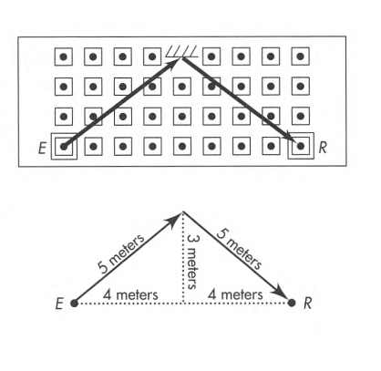

# Spacetime Physics, Chapter 3

### 3.1 The Principle of Relativity

Roughly speaking, the Principle of Relativity states says that without looking out
the window, you cannot tell which reference frame you are in or how fast you are moving.

**Galileo's Principle of Relativity**: Shut yourself up in a cabin below decks on a
ship, and you cannot tell whether the ship is at rest or moving uniformly straight
ahead.

**Extension of Galileo's reasoning from ship to spaceship**: In Galileo's account
the frames of reference are not yet free-float (inertial). To make them so requires
only a small conceptual step: from two uniformly moving sea-going ships to two
unpowered spaceships.

Then, up and down, north and south, east and west, all become alike.

This identity of the law of free motion in all inertial reference frames is what
one means today by the **Galilean Principle of Relativity**.

**Einstein's Principle of Relativity**: The laws of physics are the same in all
free-float (inertial) reference frames.

**Principle of Relativity, negative form**: No test of the laws of physics provides
any way whatsoever to distinguish one free-float frame from another.

### 3.2 What is not the same in different frames

Notice what the Principle of Relativity does not say:
- It does not say that the time between two events is the same when measured in different
  free-float frames.
- It does not say that the space separation between two events is the same when measured
  in different free-float frames.

Consequently, observers in different free-float frames don't necessarily agree on the
following:

- Velocity
- Acceleration
- Force
- Electric and magnetic fields

### 3.3 What is the same in different frames

**Laws of physics** are the same in all free-float frames. For example, how force
and acceleration are related. Or laws of electromagnetism.

**Fundamental constants** are the same. Otherwise, two different frames could be
distinguished by measuring the constant.

**Speed of light** is the same in all free-float frames in uniform relative motion.

### 3.4 Relativity of Simultaneity

Let two events occur separated in space along the direction of relative motion between
lab and rocket frames. The two events, even if simultaneous as measured by one observer,
cannot be simultaneous as measured by both observers.

**Einstein's train thought experiment**

A long and very fast train is moving at a constant speed along a straight track. Two
lightning bolts strike the train, one at the front and one at the back. Leaving char
marks both on the train and on the track, and emitting light forward and backward.

  

We have two observers:
- One standing midway on the ground
- One standing midway riding on the train

Ground observer receives the two light signals at the same time, and concludes that
**the two lightning bolts struck simultaneously**.

From the viewpoint of the ground observer, train observer is moving toward the light
from the front strike, and away from the light from the back strike. Therefore, train
observer receives the flash from the front strike first.

Train observer finds that the front flash arrives first. Since the speed of light is
constant, and she is midway between the two strikes, she concludes that the front strike
occurred before the back strike.

Thus, she concludes that **the two lightning bolts did not strike simultaneously**.

The two events are simultaneous as measured in the Earth frame, but not simultaneous
as measured in the train frame.

We say that **simultaneity is relative**, different for different frames.

Only in the special case where the two events occur at the same point (or in plane
perpendicular to the direction of relative motion) will all observers agree that the
events are simultaneous.

### 3.5. Lorentz Contraction of Length

How to measure the length of a moving rod?

One way is to mark the positions of the two ends at the same time in the lattice of
clockworks.

But we learned in the previous section that someone on the rod will not agree that
we did the marking at the same time.

In the train example, the two char marks on the track were made simultaneously for
the ground observer, so the distance between them is the length of the train as
measured by the ground observer. But the train observer wont agree.

For her, the front mark was made before the back mark, so the train will be longer
than the distance between the two marks.

**Lorentz contraction**: The space separation between the ends of the rod is less
as measured in a frame in which the rod is moving than as measured in a frame in
which the rod is at rest.

The rest length is often called the **proper length**.

### 3.6 Invariance of Transverse Dimension

A rocket ship makes many trips past the lab observer, each faster and faster. Each
time, the lab observer measures its length to be shorter than the last time.

This observed contraction is **longitudinal**, along the direction of motion.

Does the lab observer also measure contraction in the **transverse** direction,
perpendicular to the direction of motion?

The answer is **NO**.

**Speeding Train Thought Experiment**

Suppose ground observer measures the train to get thinner as it goes faster.
Then for the ground observer, right and left wheels will get closer and closer,
and will finally _slip off between tracks_.

But for the train observer, which regards herself as at rest and the tracks speeding
in the opposite direction, the tracks will get closer and closer, and finally the
train will _slip off outside the tracks_.

But this is absurd.

 

### 3.7 Invariance of the Interval Proved

Assume in the rocket ship frame, we emit a light pulse from the origin upward to
a mirror 3 meters away (event E), and it reflects back to the origin (event R).

The space separation between the two events in the rocket frame is 0 meters, and
the time separation is 6 meters.

  

Since the rocket is moving, the route of the light pulse will be longer in the lab frame.

  

The space separation between the two events in the lab frame is 8 meters.

Since the speed of light is constant in all frames, in the lab frame the time separation
will be 10 meters.

As we see, the interval is invariant: $6^2 - 0^2 = 10^2 - 8^2$.
