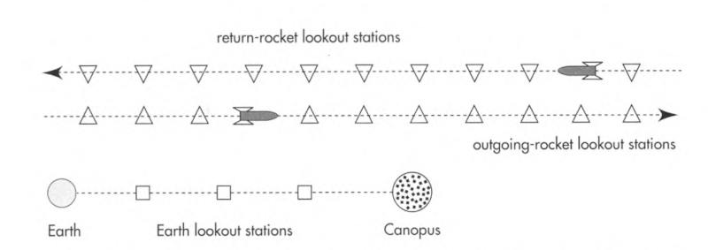
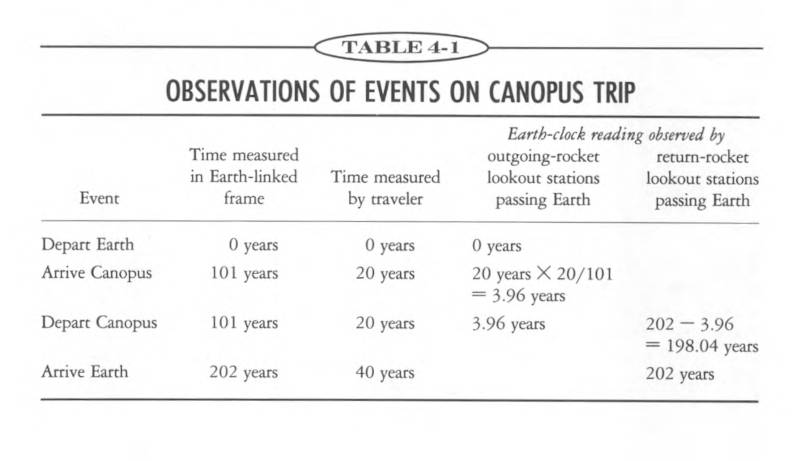

# Spacetime Physics, Chapter 4

Canopus is 99 light years away. If I have 40 more years to live, can I go
there and back within my lifetime?

### 4.3 Faster than light?

Assume we travel in a straight line in a rocket ship, and there are stations
along the way every light year from Earth. Their clocks have been synchronized
with Earth.

We start at July 4th, 2000. When we arrive at the 8th station, its clock reads
July 4th, 2010. Our clock reads July 4th, 2006.

Have we covered 8 light years in 6 years? **Are we traveling faster than light?**

The inconsistency: We measured the distance in the Earth frame, but the time
in the rocket frame. **We can only talk about the speed in one reference frame.**
We get nonsense if we mix measurements from different frames.

In the **rocket frame**,

- distance covered with respect to the rocket = 0 light years
- time took to cover that distance in the rocket frame = 6 years

Then, speed relative to the rocket frame = 0 light years / 6 years = 0.

In the **Earth frame**,
- distance covered with respect to the Earth = 8 light years
- time took to cover that distance in the Earth frame = 10 years

Then, speed relative to the Earth frame = 8 light years / 10 years = 0.8 light-speed.

### 4.4 All of Space is Ours!

Moving at 80% of light-speed, we travel 8 light years in the Earth-linked frame in
6 years of our rocket time.

Continuing at this speed, we can reach Canopus in **74 years of our rocket time**.
Better than 99 years, but not good enough.

**Revelation:** If we go fast enough, we can get to Canopus in 5 minutes of our
rocket time if we want!

In fact, no matter how far away an object lies, and no matter how much time we have, nothing
in principle prevents us from covering that distance in the allotted time.

Just note that distance here is **Earth-frame distance**, and time is **rocket-frame time**.

### 4.5 Flight Plan

We will go and return with 99/101 of light-speed.

Then the whole trip in the Earth frame will take 202 years.

The interval in the Earth frame is $$202^2 - 198^2 = 40^2$$.

Since the interval is invariant and space separation in the rocket frame is 0,
the time separation in the rocket frame is 40 years.

### 4.6 Twin Paradox

We can also say that rocket frame is stationary, and Earth is moving away at 99/101 of light-speed.

Then why don't people on Earth age only 40 years while we age 202 years?

[TODO]

### 4.7 Lorentz Contraction

Distance between Earth and Canopus in the Earth frame doesn't agree with
the distance in the rocket frame.

Any free-float frame is as good as any other for analyzing motion -- this is
the Principle of Relativity!

The factor by which the distance contracts is the same as the time stretch factor.
That is, if the distance in Earth frame is 99 light-years, and in the Earth frame
travel time is 101 and in the rocket frame is 20, then the distance in the rocket
frame is (99 light years) / (101/20) ≈ 19.6 light years.

### 4.8 Time Traveller

If we travel to Canopus at 99/101 of light-speed, and come back, we have passed
202 years on Earth while aging only 40 years.

There's no limit here. If we travel at 9999/10001 of light-speed, we can pass
198 Earth years while aging only 3.96 years. Ten such trips will get us to
about 2000 years into the future in 39.6 years of our time.

This kind of time travel is one-way.

### 4.9 Relativity of Simultaneity

When traveling to Canopus and back, we don't have one single rocket frame.
We have two: one going, and one returning.

 

Assume that there are lookout stations attached to each frame, and their clocks
have been synchronized in their respective frames.

When we arrive at Canopus, the observer on Earth will see 20 in the lookout station
attached to the going frame, while it has passed 101 years on Earth.

The observer on the outgoing rocket frame will see 20/(101/20) = 3.96 years on
the lookout station attached to Earth.

We previously said the turnaround at Canopus happens at 101 years on Earth, but
now we say when we arrive at Canopus, the Earth lookout station reads 3.96 years
(as measured on the going frame).

How is this possible?

The answer is that simultaneity is relative. Events that are simultaneous judged
from one free-float frame but far apart along the line of relative motion do not
occur simultaneously when judged from another free-float frame.

 

All disagreements can be bypassed by talking only in the invariant language of
spacetime interval, proper time.

The proper time from takeoff from Earth to arrival at Canopus is 20 years. The
proper time from turnaround at Canopus to arrival back at Earth is also 20 years.

This sum equals 40 years as experienced by the traveler.

In the Earth frame, the proper time between takeoff and arrival is 202 years.

### 4.10 Experimental Evidence

Atomic clocks have been placed on airplanes and flown around the Earth, some
going westward and some eastward. In each case the airliner clocks were
compared with reference clocks at the U.S. Naval Observatory before and after
the trips. These clocks disagreed. Results agreed with predictions based on
special relativity.
