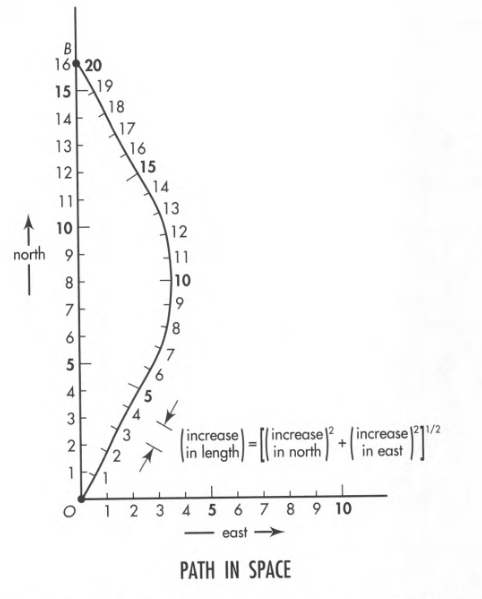

# Spacetime Physics, Chapter 5

The concept of time does not apply to location in spacetime. It applies to individual
history of travel through spacetime.

Previously, we saw the following example: In a rocket moving relative to the lab, we
emit a light flash (event E) at the origin, which is reflected from a mirror and then
received back at the origin (event R).

We had 3 frames:

1. Rocket frame
2. Lab frame
3. Super-rocket frame, which moves to the right with respect to the rocket.

Observed from 3 different frames:

 

In the figure above, squares, circles, and triangles represent the latticework of
recording clocks in the rocket, lab, and super-rocket frames.

Take event E as the reference event. Since the spacetime interval is invariant,
event R must lie on a hyperbola. As we can see in the following spacetime maps:

 

**Invariant Hyperbola:** Locus of same event in all frames.

Spacetime arrows in all three maps connect the same pair of events. They embody the
same spacetime reality. In a deeper sense, these three arrows represent **the same
arrow in spacetime**.

Spacetime maps of different observers show **different projections** of the **same
spacetime arrow**.

### 5.4 Worldline

The moving particle traces out a line on the spacetime diagram: its **worldline**.

Until now we focused on pair of events. Now we shift our attention to a whole
chain of events that track the passage of a particle through spacetime: its **worldline**.

Events exist independent of any reference frame. A worldline strings these events
together. The worldline also exists independent of any reference frame.

In the top diagram we have trajectories of 5 particles in space (not spacetime).

In the bottom diagram, we see their worldlines in spacetime. Only the event 1 has
a sample set of event points that are connected to form the worldline.

 

Note that the line drawn in the spacetime diagram is not the worldline itself. It is
**an image** of the worldline. The worldline in spacetime stands above and beyond
any particular image of it.

In the latticework of clocks, each clock records when a particle passes it. Each clock
record shows the location and time of the **event of coincidence**.

In this example, each of the particles move in a straight line in space with constant speed.
In the lab spacetime map their positions after 3 meters of time lie along the upper
horizontal **line of simultaneity**.

Below we see curved lab worldline of a particle that changes speed as it moves back
and forth along a straight line in space.

The particle initially moves to the right, then comes to rest at event Z, and then
accelerates to the left in space until it arrives at event P.

Some possible worldlines available to the particle after event P are shown. Since a particle
cannot exceed the speed of light, its possible worldlines has a limit of -45 to +45 degrees
from the vertical.

 

### 5.5 Length along a Path

In Euclidean geometry, the length of a path is independent of the coordinate system (as long
as we use the same units along each axis).

Length of a curved path can be determined by laying a flexible measuring tape along the path.
We can also measure the length using short sticks laid end to end along the path.

A curved path between two points is longer than the straight line between them.

Among all possible paths between two points in space, the straight line path is unique.

When we talk of "the distance between two points", we ordinarily mean the length of the
straight path.

 

### 5.6 Wristwatch Time along a Worldline

A curved worldline in Lorentz spacetime is measured by carrying a wristwatch along the worldline
and recording what it shows for the elapsed time.

We can also measure it by summing up intervals between adjacent events along the worldline.

In the figure below, a particle moves along the worldline, carrying a wristwatch and a sparkplug.
The sparkplug fires every meter of its own wristwatch time.

The lab observer plots the worldline using the latticework of lab clocks. He numbers the spark
points sequentially along the worldline, knowing that these numbers register meters of time
recorded by the particle's wristwatch.

 

We assume that sparks are close together in both space and time, and velocity between adjacent
adjusted sparks is nearly constant. So we can approximate the worldline with a series of short
straight segments.

Along each segment, the particle acts like a free-float rocket. The spacetime interval is
invariant in free-float rocket and free-float lab frames. Thus the lab observer can
compute the proper time between adjacent events and predict the time lapse -- one meter --
on the traveling wristwatch, which measures the proper time directly.

All observers agree on the proper time along the worldline.

**Straight worldline has longest proper time**

It is possible to proceed from event O to event B along different worldlines. Total
proper time along alternative worldlines has a **different value**.

In Lorentz geometry a curved worldline between two events is **shorter** than the
direct worldline between them.

 

Total proper time, the aging along any given worldline, straight or curved, is an
**invariant**. All observers in free-float frames agree on its value.

A different worldline between the same two events typically lead to a **different
value of aging**.

**Principle of Maximal Aging**

Aging is maximal along a straight worldline between two events. All observers agree
on the straight worldline: it is the one followed by a free particle.

**Proper times compare worldlines**

The determination of proper time along a worldline between two events is a fundamental
method of comparing different worldlines between the same two events.

Among all possible worldlines between two events, the straight worldline is unique, and
has the greatest aging.

### 5.7 Kinked Worldline

Here we assume **acceleration proof** clocks.

We are now free to analyze a motion in which particle and clock are subject to
great acceleration.

In figure below, we see three possible worldlines between O and B.

 

We have:

- Worldline OPB: proper time = 10 meters
- Worldline ORB: proper time = 0 meters
- Worldline OQB: proper time = 6 meters

Worldline ORB is when traveling at the speed of light. As far as we know, only three
things can travel at this speed: light (photons), neutrinos, and gravitons.

No material clock can travel at light speed. Therefore, the worldline ORB is not
attainable by a material particle. However, it can be approached arbitrarily closely.

### 5.8 Stretch Factor

