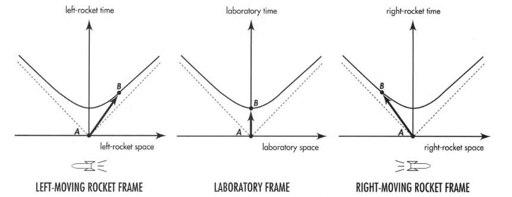
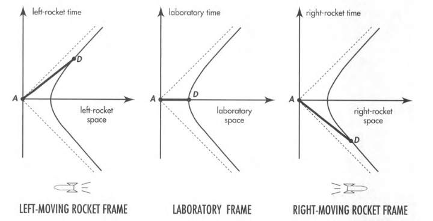
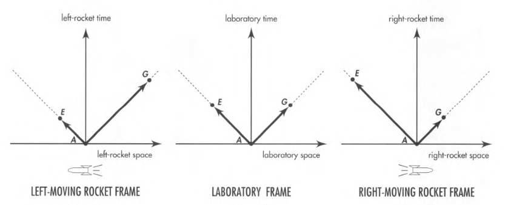
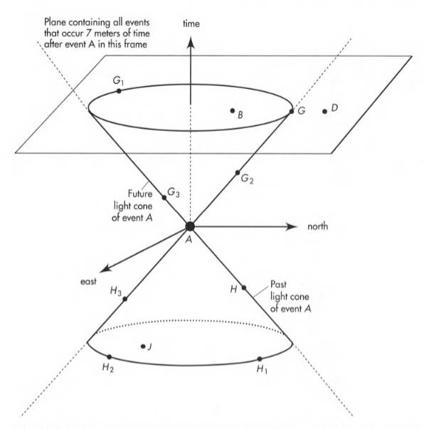

# Spacetime Physics, Chapter 6

One event cannot cause another when their spatial separation is greater than the distance
light can travel in the time separating the events.

Light speed sets a limit on causality.

No known physical process can overcome this limit: not gravity, not some other kind of
field, not a zooming particle of any kind.

"Spacetime interval" quantifies this limit on causality. Interval between far-away events
-- unlike distance between far-away points -- can be zero.

### 6.2 Relation between events: Timelike, Spacelike, Lightlike

Spacetime interval between events in Lorentz geometry is defined as:

$$
(\text{interval})^2 = (\text{time separation})^2 - (\text{space separation})^2
$$

This can be **positive**, **negative**, or **zero**.

Depending on whether the time part predominates or the space part predominates, interval
can be:

#### Timelike

$$
(\text{timelike interval})^2 = \tau^2 = (\text{time})^2 - (\text{distance})^2
$$

Time part predominates. For example, sequence of sparks emitted by a moving sparkplug.

Same two sparks registered in different frames? Same timelike interval.

Invariant hyperbola opens along the time axis.

 

Among all conceivable frames, which one records the smallest time separation?
The one in which the two events occur at the same place.

#### Spacelike

$$
(\text{spacelike interval})^2 = s^2 = (\text{distance})^2 - (\text{time})^2
$$

Space part predominates. For example, two events that occur at the same time in some
frame but at different places.

Same two events registered in different frames? Same spacelike interval.

Invariant hyperbola opens along the space axis.

 

Among all conceivable frames, which one records the smallest space separation?
The one in which the two events occur at the same time. This is called the
**proper distance** between the two events.

For a pair of events with spacelike separation, labels **"before"** and **"after"** have
no invariant meaning. They are frame-dependent (Example: figure above).

No particle -- not even a flash of light -- can move between two events connected by
a spacelike interval.

Two events separated by a spacelike interval cannot be causally related.

#### Lightlike

$$
(\text{lightlike interval})^2 = 0 = (\text{time})^2 - (\text{distance})^2
$$

Lightlike interval (**Null interval**). Time separation equals space separation.

A pulse of light can travel from event A to event G.

Only light (photons), neutrinos, and gravitons can move directly between two events
connected by a lightlike interval.

Only by means of one of these light-speed particles can one event in a lightlike
pair cause the other.

The spherical out-going pulse of light from event A may trigger two widely separated
events, E and G.

Does this mean E and G occur at the same time? There's always a frame in which they do
(lab frame in figure below).

In another frame, E occurs before G (left-rocket frame). In yet another frame, G occurs
before E (right-rocket frame).

But in no frames E or G occur before A.

 

### 6.3 Light Cone: Partition in Spacetime

Light flashes trace out a light cone in a spacetime diagram.

Let $G$, $G_1$, $G_2$, ... be future events connected to event $A$ by
lightlike intervals:

$$
(\text{future time relative to A}) = + (\text{distance in space from A})
$$

Let $H$, $H_1$, $H_2$, ... be past events connected to event $A$ by lightlike intervals:

$$
(\text{past time relative to A}) = - (\text{distance in space from A})
$$

For simplicity in figure below we just show two space dimensions.

 

A flash emitted at event A expands as a circle on the space plane.

The **future light cone** appears as the circle expands in time.

The **past light cone** traces the history of an incoming circular pulse of radiation
so perfectly focused that it converges to event A.

The light cone partitions spacetime into 5 regions:

1. **Inside the future light cone:** Can a material **particle** emitted at A affect
what is going to happen at B? Yes, if B is inside the future light cone of A.
2. **On the future light cone:** Can a **light pulse** emitted at A affect what is
going to happen at G? Yes, if G is on the future light cone of A.
3. **Absolutely elsewhere:** Can **no effect whatsoever** produced at A influence
what happens at D?
4. **Inside the past light cone:** Can a material **particle** emitted at J affect
what **is happening** at A?
5. **On the past light cone:** Can a **light pulse** emitted at H affect what
**is happening** at A?

