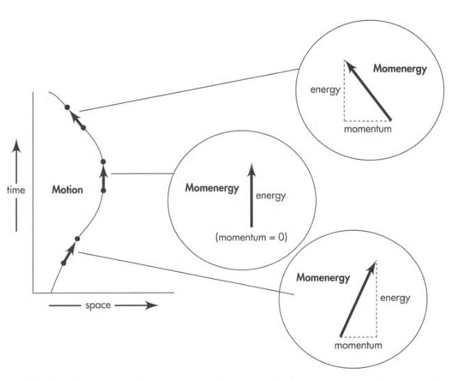
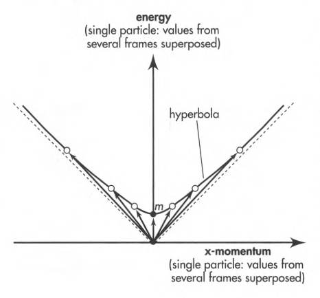
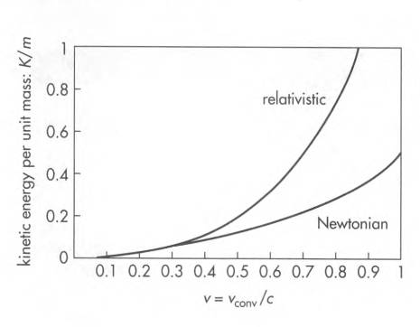
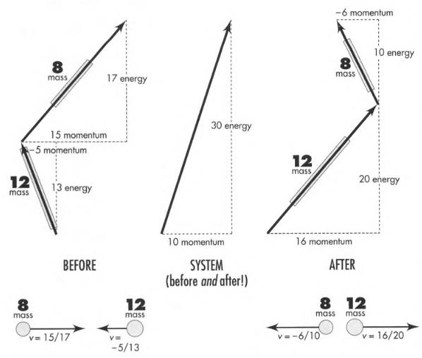
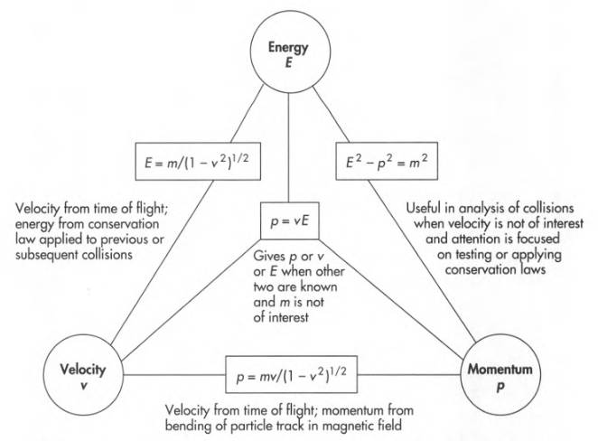

# Spacetime Physics, Chapter 7

The combination of the motion descriptive quantities (momentum and energy) of two colliding
bodies is **conserved**. We call this combined quantity momentum-energy or **momenergy**.

### 7.2 Momenergy Arrow

Magnitude of a particle's momenergy is its mass. Momenergy is a directed quantity.

**Momenergy is a 4-vector:** Momenergy is 4-dimensional vector in spacetime:

  - Three space components: representing momentum in 3 spatial directions.
  - One time component: representing energy.

Particle momenergy **points along the particle's worldline** in spacetime.
It points in the direction of particle's spacetime displacement.

Momenergy exists independently of reference frames. Particle wristwatch measures proper time for that displacement.

The resulting expression is:

$$
(\text{momenergy}) = (\text{mass}) \times \frac{(\text{spacetime displacement})}{(\text{proper time for that displacement})}
$$

The **unit 4-vector** (spacetime displacement / proper time) defines and measures the direction
of the worldline displacement, and therefore the direction of the momenergy 4-vector.

**Law of Momenergy Conservation:** Total momenergy before reaction = total momenergy after reaction.

 

Since we measure time and space using the same units, momenergy has the same unit as the
first factor: mass. This means we measure momentum and energy using the same unit: mass.

### 7.3 Momenergy Components and Magnitude

_Spacetime location_ of an event unites time and space. Similarly, the single idea of
_momenergy_ unites momentum and energy.

When we choose a reference frame,

- The space components of momenergy give the momentum in that frame.
- The time component of momenergy gives the energy in that frame.

The calculus version of this is:

$$
\begin{aligned}
E &= m \frac{dt}{d\tau} \\[0.5em]
p_x &= m \frac{dx}{d\tau} \\[0.5em]
p_y &= m \frac{dy}{d\tau} \\[0.5em]
p_z &= m \frac{dz}{d\tau}
\end{aligned}
$$

Then we have:

$$
\begin{aligned}
(\text{magnitude }&\text{of momenergy arrow})^2 \\[0.7em]
\quad &= E^2 - p^2 \\[0.5em]
\quad &= E^2 - p_x^2 - p_y^2 - p_z^2 \\[0.5em]
\quad &= m^2 \left( \frac{dt^2 - dx^2 - dy^2 - dz^2}{d\tau^2} \right) \\[0.5em]
\quad &= m^2 \left( \frac{d\tau^2}{d\tau^2} \right) \\[0.5em]
\quad &= m^2
\end{aligned}
$$

Since mass of a particle is invariant and we have $m^2 = E^2 - p^2$, then
assuming $p_y = p_z = 0$, the momenergy 4-vector for a single vector as observed
from different frames form a hyperbola in the energy-momentum plane:

 

Length of these arrows in the Lorentz geometry is invariant: always equal
to the mass of the particle.

Momenergy 4-vector of a material particle is always **timelike**. It always lies
in the same spacetime direction as the particle's worldline. The events along
the worldline have a timelike relation: Time separation exceeds space separation.

### 7.4 Momentum: "Space Part" of Momenergy

Newton called momentum "quantity of motion". In Newtonian physics, we have
$p = m \dfrac{ds}{dt}$ (valid for low velocities).

Assume a particle moves with speed $v$ in the $x$ direction. Then $x = vt$,
and therefore $dx = v dt$.

Then we have:

$$
\begin{aligned}
d\tau &= [(d\tau)^2]^{1/2} = [(dt)^2 - (dx)^2]^{1/2} = [(dt)^2 - (v dt)^2]^{1/2} \\[0.5em]
&= (dt) (1 - v^2)^{1/2} = \frac{dt}{\gamma}
\end{aligned}
$$

So, the proper time between two nearby events is always less than the lab time.

Then:

$$
\begin{aligned}
E = m \frac{dt}{d\tau} &= m \gamma \\[0.5em]
p_x = m \frac{dx}{d\tau} &= m v_x \gamma
\end{aligned}
$$

The momentum expression is the same as in Newtonian physics, except for the
factor $\gamma$. That factor is close to 1 for low speeds.

But as speed approaches the speed of light, the particle acquires a momentum
much greater than the Newtonian value.

Relativistic expression for momentum is:

$$
p = m v \gamma = \frac{m v}{\sqrt{1 - v^2}} \tag{7.8}
$$

### 7.5 Energy: "Time Part" of Momenergy

As measured in a particular free-float frame, time component of momenergy is

$$
E = m \dfrac{dt}{d\tau} = m \gamma
$$

Compare this with the Newtonian kinetic energy expression

$$
K_{\text{Newton}} = \frac{1}{2} m v^2
$$

At zero speed, the _relativistic energy_ becomes equal to mass:

$$
E_{\text{rest}} = m
$$

This is the **rest energy** of the particle.

In Newtonian mechanics, any constant can be added to the energy of a particle
without changing the laws that describe motion.

This leads us to define kinetic energy as energy above rest energy:

$$
(\text{energy}) = (\text{rest energy}) + (\text{kinetic energy})
$$

or

$$
E = m + K
$$

Thus, relativistic expression for kinetic energy is:

$$
K = m (\gamma - 1) = m \left( \frac{1}{\sqrt{1 - v^2}} - 1 \right) \tag{7.15}
$$

Dividing momentum (7.10) by kinetic energy (7.15):

$$
v = \frac{p}{E} \tag{7.16}
$$

In figure below, we see kinetic energy as a function of speed, as predicted by
relativistic (valid for any speed) and Newtonian (valid for low speeds) mechanics.

 

### 7.6 Conservation of Momenergy and its Consequences

Each component of momenergy is conserved in any interaction. That means:

- Total momentum in each direction is conserved.
- Total energy is conserved.

 

### Summary

Formulas that relate momentum, energy, mass, and velocity of a particle:

 
