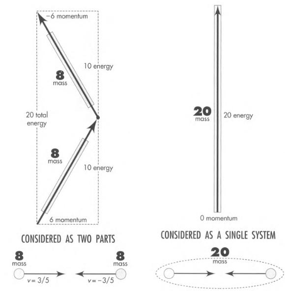
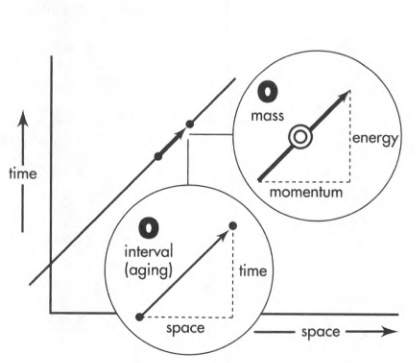
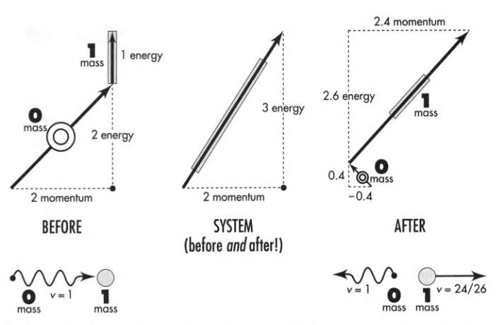
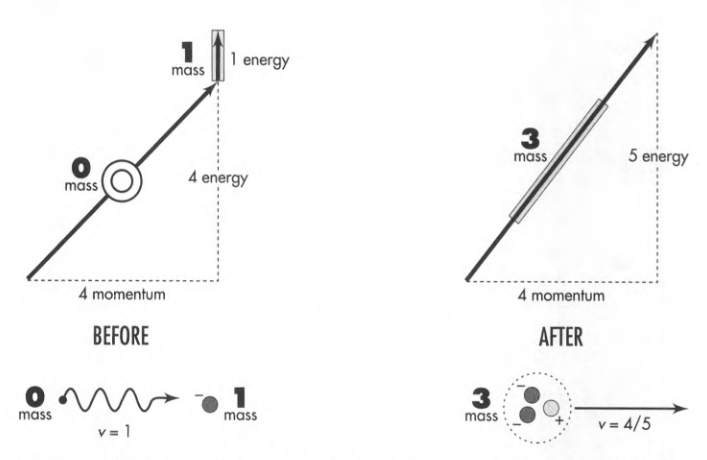

# Spacetime Physics, Chapter 8

### 8.3 Mass of a System of Particles

Energies add, momenta add, masses do not add.

**Heat is a system property.** Heat resides not in individual particles, but in the
system of particles. Heat arises not from motion of one particle, but from relative
motions of two or more particles.

The mass of a system is **greater** when system parts move relative to each other.

Remember that $E^2 - p^2 = m^2$.

In the example below, we have two non-interacting particles, each with mass 8. Taken
together as a system, their total mass is 20.
$M_\text{system} = (E_\text{system}^2 - p_\text{system}^2)^{1/2} = 20$.

 

Ask where the _extra_ $20 - 16 = 4$ units of mass are located? Silly question.

Ask where the $20$ units of mass are located? Good question. The 20 units of mass
belong to the system as a whole, not to any part individually.

Mass of an isolated system has a value independent of the choice of frame of reference
in which it is figured.

### 8.4 Energy without Mass: Photon

Light moves with zero aging. Photons move with zero mass.

Max Planck discovered that light of a given color comes only in quanta of energy of
a standard amount, an amount completely determined by the color. These packets of
energy are called photons.

What does it mean to treat a photon on the same footing as a particle? It means we
can assign to a photon an energy and a momentum, in other words, momenergy.

Photon momenergy points in **lightlike direction**, and has **magnitude zero**.

In other words, for a photon:

- Mass = 0
- Energy = Magnitude of Momentum

In the figure below, we see a worldline of a photon.

 

**Compton Collision:** The encounter between a single photon and a single electron.

We take the electron as essentially free and at rest -- at rest compared to the motion
it finds itself after the high-energy photon hits it.

 

We take the photo energy: 1.022 MeV (million electron volts). We want to express all
energies in terms of electron mass, $9.11 \times 10^{-31}$ kg, or $0.511$ MeV.

Our choice of photon energy equals exactly two electron masses.

Incoming photons of this energy when encountering an electron, are scattered by the
electron, sometimes in one direction, sometimes in another.

The figure shows the extreme case of back-scattering: an interchange of momentum takes
place that preserves the total momentum and total energy of the system.

### 8.5 Photon Used to Create Mass

An electron traveling sufficiently close to light-speed can impart on its target an
amount of energy 10, 100, or even 1000 times its own mass.

A photon in presence of an electron can create matter out of empty space.

When a photon with energy equal to 4 electron masses hits an electron at rest, the
photon most often scatters backward. Ocasionally, however, the photon produces out
of empty space a new pair of particles: an electron and a **positron**.

 When the energy of the photo is finely tuned to about 4 electron masses, the
 three particles can stick together as super-light molecule called **polyelectron**.

 (So, a polyelectron is made of two electrons and one positron.)

  

### 8.6 Material Particles Used to Create Mass

