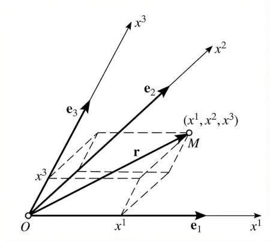
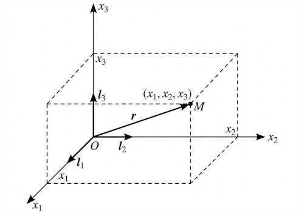
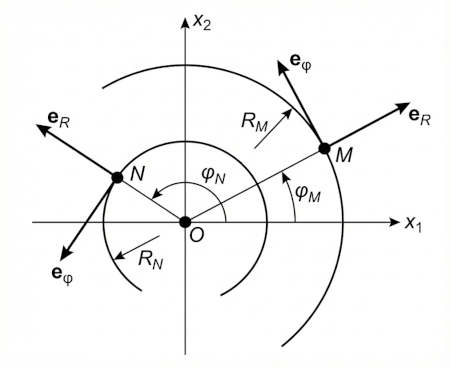
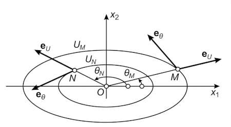
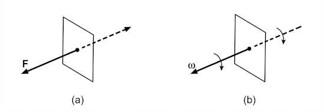
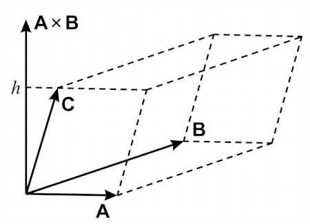
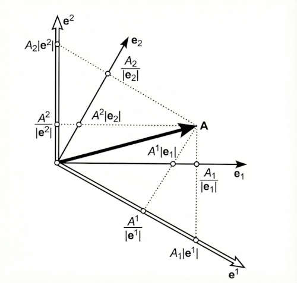
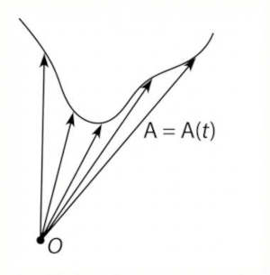

# Chapter 1. Vector Algebra

### 1.2 Operations on Vectors

##### 1.2.1. Addition of Vectors

* $\mathbf{A} + \mathbf{B} = \mathbf{B} + \mathbf{A}$ (commutative law)
* $(\mathbf{A} + \mathbf{B}) + \mathbf{C} = \mathbf{A} + (\mathbf{B} + \mathbf{C})$ (associative law)
* $\mathbf{A} + \mathbf{0} = \mathbf{A}$ (existence of zero vector)

The fact that a quantity is characterized by a magnitude and a direction is a necessary
but not sufficient condition for it to be a vector. For example, rotation of a rigid body
about an axis can be characterized by a line segment of length equal to the angle of
rotation and directed along the axis of rotation. As shown in the book, this quantity
does not add like a vector. See page 4.

##### 1.2.2. Subtraction of Vectors

If $\mathbf{X} + \mathbf{B} = \mathbf{A}$, then $\mathbf{X} = \mathbf{A} - \mathbf{B}$.

##### 1.2.3. Projection of a Vector onto an Axis

$A_u$, the projection of vector $\mathbf{A}$ onto axis $u$ is the **length** of the
segment cut from $u$ by the planes perpendicular to $u$ and passing through the
end points of $\mathbf{A}$.

##### 1.2.4. Multiplication of a Vector by a Scalar

* $m(n\mathbf{A}) = (mn)\mathbf{A}$
* $m(\mathbf{A} + \mathbf{B}) = m\mathbf{A} + m\mathbf{B}$
* $(m + n)\mathbf{A} = m\mathbf{A} + n\mathbf{A}$

### 1.3 Bases and Transformations

##### 1.3.1. Linear Dependence

Vectors $\mathbf{A}_1, \mathbf{A}_2, \ldots, \mathbf{A}_n$ are said to be linearly dependent
if there exist scalars $c_1, c_2, \ldots, c_n$, not all zero, such that

$$
c_1 \mathbf{A}_1 + c_2 \mathbf{A}_2 + \ldots + c_n \mathbf{A}_n = \mathbf{0} \tag{1.3}
$$

Two linear dependent vectors are _collinear_. Three linearly dependent vectors are
_coplanar_.

##### 1.3.2. Expansion of a Vector with respect to other Vectors

Let $\mathbf{A}$ and $\mathbf{B}$ be two linearly independent (not collinear) vectors.
Then any vector $\mathbf{C}$ coplanar with $\mathbf{A}$ and $\mathbf{B}$, has a **unique
expansion**:

$$
\mathbf{C} = m\mathbf{A} + n\mathbf{B} \tag{1.6}
$$

with respect to $\mathbf{A}$ and $\mathbf{B}$.

Same for three linearly independent (not coplanar) vectors $\mathbf{A}$, $\mathbf{B}$, and $\mathbf{C}$. In three-dimensionsal space, any vector $\mathbf{D}$ can be uniquely expanded as:

$$
\mathbf{D} = m\mathbf{A} + n\mathbf{B} + p\mathbf{C} \tag{1.8}
$$

##### 1.3.3. Basis Vectors

By a _basis_ for a three-dimensional space we mean any set of three linearly independent
vectors $\mathbf{e}_1$, $\mathbf{e}_2$, and $\mathbf{e}_3$.

Then any vector $\mathbf{A}$ will have a unique expansion:

$$
\mathbf{A} = m \mathbf{e}_1 + n \mathbf{e}_2 + p \mathbf{e}_3
$$

An **oblique coordinate system** with basis $\mathbf{e}_1$, $\mathbf{e}_2$, and $\mathbf{e}_3$:

  

If the basis vectors are mutually orthogonal and of unit length, the basis is called an
**orthonormal basis**. The coordinate system is then called **rectangular**.

  

In the rectangular case we use $x_1$, $x_2$, and $x_3$ instead of $x^1$, $x^2$, and $x^3$ 
(reason explained in section 1.6), and use $\mathbf{i}_1$, $\mathbf{i}_2$, and $\mathbf{i}_3$
instead of $\mathbf{e}_1$, $\mathbf{e}_2$, and $\mathbf{e}_3$.

Position of a point $M$ is uniquely determined by the **radius vector** $\mathbf{r} = \mathbf{r}(M)$.

Then $x_1$, $x_2$, and $x_3$ are **signed distances** between $M$ and the planes
$x_2Ox_3$, $x_3Ox_1$, and $x_1Ox_2$, and:

$$
\mathbf{r} = x_1 \mathbf{i}_1 + x_2 \mathbf{i}_2 + x_3 \mathbf{i}_3
$$

**Coordinate curves** are curves obtained by varying one coordinate while keeping the other two fixed.

In a rectangular coordinate system, the coordinate curves are straight lines parallel
to the coordinate axes.

As the basis, we choose **unit tangent vectors** to the coordinate curves at point $M$,

In a rectangular coordinate system, these are simply $\mathbf{i}_1$, $\mathbf{i}_2$, and $\mathbf{i}_3$,
and independent of the point $M$.

However, in **polar coordinates** the coordinate curves are:

* Circles centered at the origin
* Rays starting at the origin

In this case, $\mathbf{e}_R$ and $\mathbf{e}_\varphi$ vary from point to point, and always
intersect at **right angles**.

 

Coordinate systems whose basis vectors are mutually orthogonal are called **orthogonal systems**.

Coordinate systems whose coordinate curves are not straight lines are called **curvilinear systems**
(as opposed to rectangular or oblique systems).

Consider the **generalized polar coordinates** $u$ and $\theta$ whose coordinate curves are
ellipses:

 

In this cases, not only $\mathbf{e}_u$ and $\mathbf{e}_\theta$ vary from point to point,
but the angle between them also varies and in general is not a right angle.

##### 1.3.4. Transformation of Basis Vectors

Consider two bases $\mathbf{e}_1$, $\mathbf{e}_2$, $\mathbf{e}_3$ and $\mathbf{e}_1'$, $\mathbf{e}_2'$, $\mathbf{e}_3'$. Let $\alpha_{i'}^1$, $\alpha_{i'}^2$, $\alpha_{i'}^3$ be the coefficients of
the expansion of $\mathbf{e}_{i}'$ with respect to the first basis. Then:

$$
\mathbf{e}_{i}' = \sum_{k=1}^{3} \alpha_{i'}^{k} \mathbf{e}_{k} \quad (i = 1, 2, 3) \tag{1.11}
$$

The nine numbers $\alpha_{i'}^{k}$ are called the **coefficients of the direct transformation**
(from the unprimed to the primed basis).

Similarly, if

$$
\mathbf{e}_{i} = \sum_{k=1}^{3} \alpha_{i}^{k'} \mathbf{e}_{k}' \quad (i = 1, 2, 3) \tag{1.12}
$$

then the nine numbers $\alpha_{i}^{k'}$ are called the **coefficients of the inverse transformation**
(from the primed to the unprimed basis).

It follows that

$$
\begin{aligned}
\sum_{l=1}^{3} \alpha_{i'}^{l} \alpha_{l}^{j'} &= \begin{cases} 
0 & \text{if } i \neq j, \\ 
1 & \text{if } i = j, 
\end{cases} \\
\sum_{l=1}^{3} \alpha_{i}^{l'} \alpha_{l'}^{j} &= \begin{cases} 
0 & \text{if } i \neq j, \\ 
1 & \text{if } i = j. 
\end{cases}
\end{aligned}
\tag{1.14}
$$

### 1.4 Products of Two Vectors

##### 1.4.1. Scalar Product

$$
\mathbf{A} \cdot \mathbf{B} = \lvert \mathbf{A} \rvert \, \lvert \mathbf{B} \rvert \cos (\mathbf{A}, \mathbf{B}) \tag{1.15}
$$

It follows that:

$$
\mathbf{A} \cdot \mathbf{B} = A_B\, B = A\, B_A
$$

(where $A_B$ and $B_A$ are the projections of $\mathbf{A}$ and $\mathbf{B}$ onto each other).

Properties:

- Commutative: $\mathbf{A} \cdot \mathbf{B} = \mathbf{B} \cdot \mathbf{A}$
- Distributive: $\mathbf{A} \cdot (\mathbf{B} + \mathbf{C}) = \mathbf{A} \cdot \mathbf{B} + \mathbf{A} \cdot \mathbf{C}$
- Necessary and sufficient condition for orthogonality: $\mathbf{A} \perp \mathbf{B} \iff \mathbf{A} \cdot \mathbf{B} = 0$

Given a system of rectangular coordinates with basis $\mathbf{i}_1$, $\mathbf{i}_2$, $\mathbf{i}_3$,

$$
\mathbf{A} = (\mathbf{A} \cdot \mathbf{i}_1) \mathbf{i}_1 + (\mathbf{A} \cdot \mathbf{i}_2) \mathbf{i}_2 + (\mathbf{A} \cdot \mathbf{i}_3) \mathbf{i}_3 \tag{1.20}
$$

Scalar product in terms of components:

$$
\mathbf{A} \cdot \mathbf{B} = A_1 B_1 + A_2 B_2 + A_3 B_3 \tag{1.21}
$$

##### 1.4.2. Vector Product

Given two vectors $\mathbf{A}$ and $\mathbf{B}$, their **vector product** $\mathbf{C} = \mathbf{A} \times \mathbf{B}$ is defined as the vector $\mathbf{C}$ such that:

1. $\lvert \mathbf{C} \rvert = \lvert \mathbf{A} \rvert \, \lvert \mathbf{B} \rvert \sin (\mathbf{A}, \mathbf{B})$ (area of the parallelogram with sides $\mathbf{A}$ and $\mathbf{B}$)
2. $\mathbf{C} \perp$ plane containing $\mathbf{A}$ and $\mathbf{B}$
3. $\mathbf{C}$ is directed  from which the rotation from $\mathbf{A}$ to $\mathbf{B}$ appears counterclockwise.

Properties:

- Anticommutative: $\mathbf{A} \times \mathbf{B} = -(\mathbf{B} \times \mathbf{A})$
- Distributive: $\mathbf{A} \times (\mathbf{B} + \mathbf{C}) = \mathbf{A} \times \mathbf{B} + \mathbf{A} \times \mathbf{C}$
- Necessary and sufficient condition for two vectors to be parallel: $\mathbf{A} \parallel \mathbf{B} \iff \mathbf{A} \times \mathbf{B} = \mathbf{0}$

**Axial Vectors** are vectors whose direction is established by convention, and which therefore
change direction when the "handedness" of the coordinate system changes. Examples:
moment of a force, angular velocity, etc.

**Polar Vectors** are vectors whose direction is determined by the physical meaning, and which therefore
do not change direction when the "handedness" of the coordinate system changes. Examples: force, velocity, etc.

To determine the nature of a vector, imagine it reflected in a mirror.

Force is a polar vector, since reflection inverses the force. Angular velocity is an axial vector,
since reflection does not change the sense of rotation.

 

Vector product as a determinant:

$$
\mathbf{A} \times \mathbf{B} = \begin{vmatrix}
\mathbf{i}_1 & \mathbf{i}_2 & \mathbf{i}_3 \\
A_1 & A_2 & A_3 \\
B_1 & B_2 & B_3
\end{vmatrix} \tag{1.24}
$$

##### 1.4.3. Physical Examples

**Work of a Force**. If $\mathbf{F}$ is the force acting on a particle which undergoes a displacement
of $\mathbf{s}$, then the work $W$ done by the force is defined as:

$$
W = F_s \, s = F \, s \, \cos (\mathbf{F}, \mathbf{s}) = \mathbf{F} \cdot \mathbf{s} \tag{1.25}
$$

**Moment of a Force**. The moment $\mathbf{M}$ of a force $\mathbf{F}$ about point $O$ is defined as:

$$
\mathbf{M} = \mathbf{r} \times \mathbf{F}
$$

where $\mathbf{r}$ is the vector joining point $O$ to the initial point of $\mathbf{F}$.

**Electromagnetics**. Force experienced by a charge $e$ in an electric field $\mathbf{E}$ is:

$$
\mathbf{F}_e = e \, \mathbf{E}
$$

while an electric charge $e$ moving with velocity $\mathbf{v}$ in a magnetic field $\mathbf{H}$
experiences a force:

$$
\mathbf{F}_m = \frac{e}{c} \left( \mathbf{v} \times \mathbf{H} \right)
$$

Then, the total force experienced by a moving charge is:

$$
\mathbf{F} = e \, \mathbf{E} + \frac{e}{c} \left( \mathbf{v} \times \mathbf{H} \right)
$$

If the charge moves a distance $d\mathbf{r}$, the work done by the electromagnetic field is:

$$
\begin{aligned}
\mathbf{F} \cdot d\mathbf{r} &= \mathbf{F} \cdot \frac{d\mathbf{r}}{dt} dt \\[0.5em]
&= \mathbf{F} \cdot \mathbf{v} \, dt \\[0.5em]
&= \left( e \, \mathbf{E} + \frac{e}{c} \left( \mathbf{v} \times \mathbf{H} \right) \right) \cdot \mathbf{v} \, dt \\[0.5em]
&= e \, \mathbf{E} \cdot \mathbf{v} \, dt
\end{aligned}
$$

Since $\mathbf{v} \times \mathbf{H}$ is perpendicular to $\mathbf{v}$, the magnetic field does no work on the charge.

This work goes into changing the kinetic energy $U$ of the moving charge:

$$
\frac{dU}{dt} = e \, \mathbf{E} \cdot \mathbf{v}
$$

The magnetic field can change the direction of motion of the charge, but not the magnitude of its velocity.

### 1.5 Producs of Three Vectors

**1.5.1. Triple scalar product** of vectors $\mathbf{A}$, $\mathbf{B}$, and $\mathbf{C}$ is:

$$
V = (\mathbf{A} \times \mathbf{B}) \cdot \mathbf{C} = \lvert \mathbf{A} \times \mathbf{B} \rvert \,
C_{\mathbf{A} \times \mathbf{B}} = \lvert \mathbf{A} \rvert \, \lvert \mathbf{B} \rvert \, h
$$

 

The scalar triple product is the volume of the parallelepiped formed by the three vectors.

Using the determinant, we have:

$$
(\mathbf{A} \times \mathbf{B}) \cdot \mathbf{C} = \begin{vmatrix}
C_1 & C_2 & C_3 \\
A_1 & A_2 & A_3 \\
B_1 & B_2 & B_3
\end{vmatrix} \tag{1.26}
$$

It folllows that:

$$
(\mathbf{A} \times \mathbf{B}) \cdot \mathbf{C} = (\mathbf{B} \times \mathbf{C}) \cdot \mathbf{A} = (\mathbf{C} \times \mathbf{A}) \cdot \mathbf{B} \tag{1.27}
$$

**1.5.2. Vector triple product** of vectors $\mathbf{A}$, $\mathbf{B}$, and $\mathbf{C}$ is
the vector $\mathbf{A} \times (\mathbf{B} \times \mathbf{C})$.

It is perpendicular to $\mathbf{A}$, and lies in the plane of $\mathbf{B}$ and $\mathbf{C}$.

Assuming $\mathbf{A}$, $\mathbf{B}$, and $\mathbf{C}$ are noncollinear, then $\mathbf{A} \times (\mathbf{B} \times \mathbf{C})$ has a unique expansion:

$$
\mathbf{A} \times (\mathbf{B} \times \mathbf{C}) = m \mathbf{B} + n \mathbf{C} \tag{1.29}
$$

It can be shown that:

$$
\mathbf{A} \times (\mathbf{B} \times \mathbf{C}) = \mathbf{B} (\mathbf{A} \cdot \mathbf{C}) - \mathbf{C} (\mathbf{A} \cdot \mathbf{B}) \tag{1.30}
$$

### 1.6 Reciprocal Bases and Related Topics

##### 1.6.1. Reciprocal Bases

**Goal**

We want to expand an arbitrary vector $\mathbf{A}$ with respect to three noncoplanar vectors
$\mathbf{e}_1$, $\mathbf{e}_2$, and $\mathbf{e}_3$, which are not necessarily orthogonal or
of unit length:

$$
\mathbf{A} = A^1 \mathbf{e}_1 + A^2 \mathbf{e}_2 + A^3 \mathbf{e}_3
$$

This can be solved using the method of **reciprocal bases**.

**Definition**

Two bases $\mathbf{e}_1$, $\mathbf{e}_2$, $\mathbf{e}_3$ and $\mathbf{e}^1$, $\mathbf{e}^2$, $\mathbf{e}^3$ are said to be **reciprocal** if:

$$
\mathbf{e}_i \cdot \mathbf{e}^j = \begin{cases}
1 & \text{if } i = j, \\
0 & \text{if } i \neq j.
\end{cases} \tag{1.34}
$$

**Calculation of Reciprocal Bases**

This implies that:

1. Each vector of one basis is perpendicular to two vectors of the other basis.
2. $\lvert \mathbf{e}_i \rvert \, \lvert \mathbf{e}^i \rvert \cos (\mathbf{e}_i, \mathbf{e}^i) = 1 > 0$,
  so the angle between corresponding vectors of the two bases is acute (possibly right).

From (1), we have $\mathbf{e}^i$ is collinear with $\mathbf{e}_j \times \mathbf{e}_k$, so
$\mathbf{e}^i = m \, (\mathbf{e}_j \times \mathbf{e}_k)$ for some scalar $m$. We can find $m$ using
(2), and after some algebra we get:

$$
\mathbf{e}^i = \frac{\mathbf{e}_j \times \mathbf{e}_k}{\mathbf{e}_1 \cdot (\mathbf{e}_2 \times \mathbf{e}_3)} = \frac{\mathbf{e}_j \times \mathbf{e}_k}{V} \tag{1.36}
$$

where $(i, j, k)$ is any cyclic permutation of (1, 2, 3) and $V$ is the volume of the parallelepiped
formed by $\mathbf{e}_1$, $\mathbf{e}_2$, and $\mathbf{e}_3$.

Similarly:

$$
\mathbf{e}_i = \frac{\mathbf{e}^j \times \mathbf{e}^k}{\mathbf{e}^1 \cdot (\mathbf{e}^2 \times \mathbf{e}^3)} = \frac{\mathbf{e}^j \times \mathbf{e}^k}{V'}
$$

where $(i, j, k)$ is any cyclic permutation of (1, 2, 3) and $V'$ is the volume of the parallelepiped
formed by $\mathbf{e}^1$, $\mathbf{e}^2$, and $\mathbf{e}^3$.

> [!NOTE]
> 1. Reciprocal of an orthonormal basis is itself.
> 2. Two reciprocal bases are either both right-handed or both left-handed. This follows
> from the formula $V \, V' = 1$.

**Using Reciprocal Bases to Expand Vectors**

We return to the problem of finding the coefficients $A^1$, $A^2$, and $A^3$:

$$
\mathbf{A} = A^1 \mathbf{e}_1 + A^2 \mathbf{e}_2 + A^3 \mathbf{e}_3
$$

From (1.34), it follows that:

$$
\mathbf{A} \cdot \mathbf{e}^i = \sum_{k=1}^{3} A^k (\mathbf{e}_k \cdot \mathbf{e}^i) = A^i
$$

Thus:

$$
\mathbf{A} = (\mathbf{A} \cdot \mathbf{e}^1) \mathbf{e}_1 + (\mathbf{A} \cdot \mathbf{e}^2) \mathbf{e}_2 + (\mathbf{A} \cdot \mathbf{e}^3) \mathbf{e}_3
$$

and similarly:

$$
\mathbf{A} = (\mathbf{A} \cdot \mathbf{e}_1) \mathbf{e}^1 + (\mathbf{A} \cdot \mathbf{e}_2) \mathbf{e}^2 + (\mathbf{A} \cdot \mathbf{e}_3) \mathbf{e}^3
$$

##### 1.6.2. Summation Convention

1. Every index appearing once can take values from 1 to 3.
   - $A_i$ means $A_1$, $A_2$, and $A_3$.
   - $A_{ik}$ means $A_{11}$, $A_{12}$, ..., $A_{33}$.
2. Every index appearing twice is regarded as being summed from 1 to 3.
   - $A_{ii} = \sum_{i=1}^{3} A_{ii}$
   - $A_{i} B^{i} = \sum_{i=1}^{3} A_{i} B^{i}$
   - $A_{i} B^{k} C^{i} = B^{k} \sum_{i=1}^{3} A_{i} C^{i}$

Another convention used in the book:

Let $K$ and $K'$ be two coordinate systems, and let $P$ be an arbitrary point. Then

- $x_i$ are the coordinates of point $P$ in system $K$ (or $x^i$ if $K$ is not rectangular)
- $x'_{i}$ are the coordinates of the _same point_ $P$ in system $K'$ (or $x'\,^{i}$ if $K'$ is not rectangular)

Same rules apply to components of vectors.

##### 1.6.3. Covariant and Contravariant Components of a Vector

As we saw, the same vector $\mathbf{A}$ can be expanded in two ways:

$$
\begin{align}
\mathbf{A} &= A^i \mathbf{e}_i \tag{1.41} \\
\mathbf{A} &= A_i \mathbf{e}^i \tag{1.42}
\end{align}
$$

where $A^i = \mathbf{A} \cdot \mathbf{e}^i$ and $A_i = \mathbf{A} \cdot \mathbf{e}_i$.

The numbers $A^i$ are called the **contravariant** components of vector $\mathbf{A}$,
while the numbers $A_i$ are called the **covariant** components of vector $\mathbf{A}$.

Covariant and contravariant components of a vector in the plane:

  

The covariant components $A_1$, $A_2$ can be found in two ways:

- From components $A_1 \lvert \mathbf{e}^1 \rvert$, $A_2 \lvert \mathbf{e}^2 \rvert$ of
  the projection of $\mathbf{A}$ onto the directions of reciprocal basis.
- From the projections $A_1/\lvert \mathbf{e}_1 \rvert$, $A_2/\lvert \mathbf{e}_2 \rvert$
  of $\mathbf{A}$ onto the directions of the original basis.

**Explaining the Names**

The **direct** transformation of the **covariant** components involves the coefficients
$\alpha_{i'}^{k}$ of the **direct** transformation:

$$
A'_{i} = \alpha_{i'}^{k} A_{k} \tag{1.43}
$$

While the **direct** transformation of the **contravariant** components involves the
coefficients $\alpha_{k}^{i'}$ of the **inverse** transformation:

$$
A'\,^{i} = \alpha_{k}^{i'} A^{k} \tag{1.44}
$$

:::card[example]

**Example.** Let $\mathbf{e}_1 = (1, 0)$, $\mathbf{e}_2 = (0, 1)$, and $\mathbf{A} = (1, 1)$.

Then the reciprocal basis is $\mathbf{e}^1 = (1, 0)$, $\mathbf{e}^2 = (0, 1)$.

Covariant components: $A_1 = 1$, $A_2 = 1$, contravariant components: $A^1 = 1$, $A^2 = 1$.

Consider the new basis $\mathbf{e}_1' = (2, 0)$, $\mathbf{e}_2' = (0, 2)$.
The new reciprocal basis is $\mathbf{e}'^1 = \left(\frac{1}{2}, 0\right)$, $\mathbf{e}'^2 = \left(0, \frac{1}{2}\right)$.

The direct basis transformation matrix is:

$$
\Gamma = \begin{pmatrix}
2 & 0 \\
0 & 2
\end{pmatrix}
$$

and inverse basis transformation matrix is:

$$
\Gamma^{-1} = \begin{pmatrix}
\frac{1}{2} & 0 \\
0 & \frac{1}{2}
\end{pmatrix}
$$

Covariant components transform with the direct transformation and are $A_1' = 2$, $A_2' = 2$.

Contravariant components transform with the inverse transformation and are $A'^1 = \frac{1}{2}$, $A'^2 = \frac{1}{2}$.

As we can verify $\mathbf{A} = A'^{1}\,\mathbf{e}_1' + A'^{2}\,\mathbf{e}_2' = A'_1\,\mathbf{e}'^{1} + A'_2\,\mathbf{e}'^{2}$.
::::

##### 1.6.4. Physical Components of a Vector

It is possible to introduce "physical" components of a vector, whose dimensions are the same
coincide with those of the vector itself.

To do this, we use **unit basis**:

$$
\mathbf{e}_i^* = \frac{\mathbf{e}_i}{\lvert \mathbf{e}_i \rvert}
$$

and its reciprocal:

$$
\mathbf{e}^{*i} = \mathbf{e}^i \, \lvert \mathbf{e}_i \rvert
$$

Then the vector $\mathbf{A}$ can be expanded as:

$$
\mathbf{A} = A_i^* \, \mathbf{e}^{*i} = A^{*i} \, \mathbf{e}^{*}_i
$$

where, by definition, $A_i^*$ and $A^{*i}$ are the **physical components** of $\mathbf{A}$.

##### 1.6.5. Relation between Covariant and Contravariant Components

We introduce the notation:

$$
\begin{align*}
g_{ij} &= \mathbf{e}_i \cdot \mathbf{e}_j \\
g^{ij} &= \mathbf{e}^i \cdot \mathbf{e}^j \\
g_i^j &= \mathbf{e}_i \cdot \mathbf{e}^j = \delta_i^j
\end{align*}
$$

Then covariant and contravariant components are related by:

$$
\begin{align}
A_i &= g_{ij} \, A^j \tag{1.48} \\
A^i &= g^{ij} \, A_j \tag{1.49}
\end{align}
$$

We will show later that the nine quantities $g_{ij}$ form a second-order tensor, and so do
$g^{ij}$ and $g_i^j$.

Assume $d\mathbf{r}$ is the vector joining two infinitely close points, and let its
covariant and contravariant components be $dx_i$ and $dx^i$. Arc length between
the two points is $ds = \lvert d\mathbf{r} \rvert$, so:

$$
(ds)^2 = \lvert d\mathbf{r} \rvert^2 = d\mathbf{r} \cdot d\mathbf{r}
= \mathbf{e}_i \, dx^i \cdot \mathbf{e}_j \, dx^j
= \mathbf{e}_i \, dx^i \cdot \mathbf{e}^j \, dx_j
= \mathbf{e}^i \, dx_i \cdot \mathbf{e}^j \, dx_j
$$

Thus:

$$
\begin{align*}
(ds)^2 &= g_{ij} \, dx^i \, dx^j \\
(ds)^2 &= g^{ij} \, dx_i \, dx_j \tag{1.50} \\
(ds)^2 &= dx_i \, dx^i
\end{align*}
$$

So, (1.50) gives the arc length in terms of $g_{ij}$ or $g^{ij}$.

Therefore, $g_{ij}$ and $g^{ij}$ **determine the metric** of the space, and are called
the **metric tensors**.

**Expressing quantities $g^{ij}$ in terms of quantities $g_{ij}$**

Let

$$
G = \det g_{ij} = \begin{vmatrix}
g_{11} & g_{12} & g_{13} \\
g_{21} & g_{22} & g_{23} \\
g_{31} & g_{32} & g_{33}
\end{vmatrix}
$$

and $G^{ij}$ be the cofactor of $g_{ij}$ in the determinant $G$:

$$
G^{11} = \begin{vmatrix}
g_{22} & g_{23} \\
g_{32} & g_{33}
\end{vmatrix}, \quad
G^{12} = \begin{vmatrix}
g_{21} & g_{23} \\
g_{31} & g_{33}
\end{vmatrix}, \quad
G^{13} = \begin{vmatrix}
g_{21} & g_{22} \\
g_{31} & g_{32}
\end{vmatrix}
$$

Then it can be shown that:

$$
g^{ij} = \frac{G^{ij}}{G} \tag{1.52}
$$

**Expressing quantities $g_{ij}$ in terms of quantities $g^{ij}$**

Similarly, let $G' = \det g^{ij}$ and $G_{ij}$ be the cofactor of $g^{ij}$ in the determinant $G'$.

Then it can be shown that:

$$
g_{ij} = \frac{G_{ij}}{G'}
$$

**Volume of the Parallelepiped formed by Basis Vectors**

It can be shown that:

$$
V = \pm \sqrt{G} \tag{1.54}
$$

where $V$ is the volume of the parallelepiped formed by $\mathbf{e}_1$, $\mathbf{e}_2$,
$\mathbf{e}_3$, and the plus sign is taken if the basis $\mathbf{e}_1$, $\mathbf{e}_2$,
$\mathbf{e}_3$ is right-handed.

Similarly,

$$
V' = \pm \sqrt{G'}
$$

where $V'$ is the volume of the parallelepiped formed by $\mathbf{e}^1$, $\mathbf{e}^2$, $\mathbf{e}^3$.

In particular, for reciprocal bases, we have $V' = 1/V$, so:

$$
G \, G' = 1
$$

##### 1.6.6. The case of Orthogonal Bases

Most of the time, the coordinate systems used in physics and applied maths are orthogonal.

In this case, both original and reciprocal bases are orthogonal, so:

$$
g_{ij} = g^{ij} = 0 \quad \text{for } i \neq j
$$

Then (1.48) and (1.49) become:

$$
\begin{align*}
A_1 &= g_{11} \, A^1, \quad A_2 = g_{22} \, A^2, \quad A_3 = g_{33} \, A^3 \\[0.5em]
A^1 &= g^{11} \, A_1, \quad A^2 = g^{22} \, A_2, \quad A^3 = g^{33} \, A_3
\end{align*}
$$

and as a result:

$$
g_{11} = \frac{1}{g^{11}}, \quad g_{22} = \frac{1}{g^{22}}, \quad g_{33} = \frac{1}{g^{33}}
$$

Moreover,

$$
(ds)^2 = \sum_{i=1}^{3} (h_i \, dx^i)^2
$$

where the quantities $h_i = \sqrt{g_{ii}}$ are called the **metric coefficients**.

### 1.7 Variable Vectors

##### 1.7.1. Vector Functions of a Scalar Argument

Vectors can vary with time or position: $\mathbf{A} = \mathbf{A}(\mathbf{r}, t)$.

Here we confine ourselves to the scalar argument case: $\mathbf{A} = \mathbf{A}(t)$.

Suppose $\mathbf{A}(t)$ is draw from a fixed point $O$. Then tip of $\mathbf{A}(t)$ traces a
curve called **hodograph** of $\mathbf{A}$.

 

##### 1.7.2. Derivative of a Vector Function

