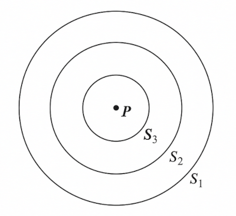
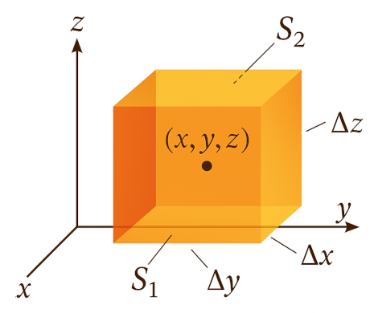
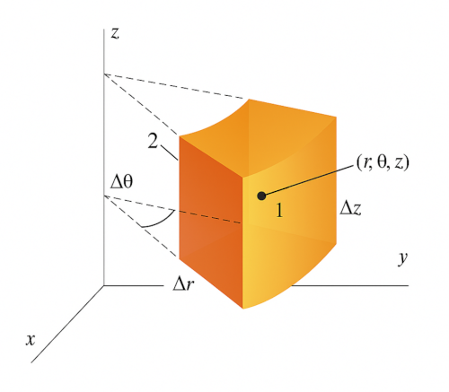

# Surface Integrals and Divergence

### Gauss's Law
Goal: A convenient way to find the **electorstatic field**.

Doesn't equations in last section already solve this? Generally, no. Unless
we have very few charges and/or they are arrange simply or symmetrically.
So, they're not very useful in practice.

Which brings us to **Gauss's Law**:

$$
\int\int_S \mathbf{E} \cdot \hat{\mathbf{n}} \\, dS = \frac{q}{\epsilon_0}
\tag{II-1}
$$

Here we are doing a **surface integral**, where integrand is the dot product
of the electric field $\mathbf{E}$ and the unit normal vector $\hat{\mathbf{n}}$.

We'll discuss these in the following sections.

### The Unit Normal Vector
Let $\mathbf{u}$ and $\mathbf{v}$ be two non-collinear tangent vectors to a surface $S$ at a point $P$. A vector $\mathbf{N}$ perpendicular to both $\mathbf{u}$ and $\mathbf{v}$ is called a **normal vector** to $S$ at $P$.

Cross product of $\mathbf{u}$ and $\mathbf{v}$ has this property. Thus:

$$
\mathbf{\hat{n}} = \frac{\mathbf{N}}{|\mathbf{N}|} 
= \frac{\mathbf{u} \times \mathbf{v}}{|\mathbf{u} \times \mathbf{v}|}
$$

Assume $S$ is given by the equation $z = f(x, y)$. Then parametric equation
of $S$ is $\mathbf{s}(x, y) = (x, y, f(x, y))$.

Let $x$-curve be given when we hold $y$ constant and vary $x$:
$\mathbf{s}(x, y_0) = (x, y_0, f(x, y_0))$.
Let $y$-curve be given when we hold $x$ constant and vary $y$:
$\mathbf{s}(x_0, y) = (x_0, y, f(x_0, y))$.

Then the tangent at point $P$ to the $x$-curve is $\mathbf{s}_x = \dfrac{\partial \mathbf{s}}{\partial x} = (1, 0, \dfrac{\partial f}{\partial x})$, and the tangent at point $P$ to the $y$-curve is $\mathbf{s}_y = \dfrac{\partial \mathbf{s}}{\partial y} = (0, 1, \dfrac{\partial f}{\partial y})$.

The normal vector is given by $\mathbf{N} = \mathbf{s}_x \times \mathbf{s}_y$.

Thus, the unit normal vector is given by:

$$
\begin{align*}
\mathbf{\hat{n}} = \frac{\mathbf{s}_x \times \mathbf{s}_y}{|\mathbf{s}_x \times \mathbf{s}_y|}
&= \frac{\left(1, 0, \dfrac{\partial f}{\partial x}\right) \times \left(0, 1, \dfrac{\partial f}{\partial y}\right)}{|\mathbf{s}_x \times \mathbf{s}_y|}
\\\\[1em]
&= \frac{-\mathbf{i}\dfrac{\partial f}{\partial x} + -\mathbf{j}\dfrac{\partial f}{\partial y} + \mathbf{k}}{\sqrt{1 + \left(\dfrac{\partial f}{\partial x}\right)^2 + \left(\dfrac{\partial f}{\partial y}\right)^2}}
\tag{II-4}
\end{align*}
$$

> [!WARNING]
> My derivation is a bit different from the book, but the steps are 
> equivalent and the final result is the same.

### Definition of Surface Integrals
The **surface integral of the normal component** of a vector function $\mathbf{F}(x, y, z)$, denoted by

$$
\int\int_S \mathbf{F} \cdot \hat{\mathbf{n}} \\, dS
\tag{II-5}
$$

Let's approaximate $S$ by a collection of small flat pieces, each of which is
tangent to $S$ at some point.

Let's focus on the $i$-th piece. Let $\Delta S_i$ be the area, and $(x_i, y_i, z_i)$ be the coordinate of the tangent point, and $\hat{\mathbf{n}}_i$ be the unit normal vector at that point.

Then summing over all pieces, we have:

$$
\sum_{i=1}^N \mathbf{F}(x_i, y_i, z_i) \cdot \hat{\mathbf{n}}_i \Delta S_i
$$

The surface integral (II-5) is the limit of this sum as the number of pieces
approaches infinity and the area of each piece approaches zero:

$$
\int\int_S \mathbf{F} \cdot \hat{\mathbf{n}} \\, dS = \lim_{\substack{N \to \infty\\\\[0.3em] \text{each } \Delta S_i \to 0}} \sum_{i=1}^N \mathbf{F}(x_i, y_i, z_i) \cdot \hat{\mathbf{n}}_i \Delta S_i
\tag{II-6}
$$

The surface over which we integrate can be:
* **closed**, which divides the space into two regions, inside and outside. For
  example, the surface of a sphere.
* **open**, a surface which is not closed. For example, a flat piece of paper.

In the case of an open surface, the unit normal vector can point in either direction, and it should be specified. In the case of a closed surface, the agreement is that the unit normal vector points outward from the surface.

The integral in **Gauss's Law** is taken over a closed surface. In fact, it says that the surface integral of the electric field over a closed surface is equal to the total charge inside the surface divided by $\epsilon_0$.

Sometimes, we are interested in simpler integrals of the form:

$$
\int\int_S G(x, y, z) \\, dS
\tag{II-7}
$$

This can be solved similarly:

$$
\int\int_S G(x, y, z) \\, dS = \lim_{\substack{N \to \infty\\\\[0.3em] \text{each } \Delta S_i \to 0}} \sum_{i=1}^N G(x_i, y_i, z_i) \Delta S_i
\tag{II-8}
$$

### Evaluating Surface Integrals

We want to evaluate:

$$
\int\int_S G(x, y, z) \\, dS
$$

Our strategy is to relate $\Delta S_i$ to the area of its projection on the $xy$-plane, as shown in the figure below.

This will allow us to use ordinary double integrals over $R$, the projection of $S$ on the $xy$-plane.

We want to find the relation between the area of rectangle
and area of its projection in the $xy$-plane.

Assume one pair of sides are parallel to the $xy$-plane, and the other pair makes angle $\theta$ with the $xy$-plane.

We can convince ourselves that $\cos \theta = \hat{\mathbf{k}} \cdot \hat{\mathbf{n}}$, where $\hat{\mathbf{k}}$ is the unit normal vector to the $xy$-plane.

Thus, the area of the rectangle is:

$$
ab = \frac{ab'}{\cos \theta} = \frac{ab'}{\hat{\mathbf{k}} \cdot \hat{\mathbf{n}}}
$$

Each $\Delta S_i$ can be approximated by such rectangles. Thus, we have:

$$
\Delta S_i = \frac{\Delta R_i}{\hat{\mathbf{k}} \cdot \hat{\mathbf{n}}}
$$

So, the surface integral can be written as:

$$
\int\int_S G(x, y, z) \\, dS = \lim_{\substack{N \to \infty\\\\[0.3em] \text{each } \Delta R_i \to 0}} \sum_{i=1}^N G(x_i, y_i, z_i) \frac{\Delta R_i}{\hat{\mathbf{k}} \cdot \hat{\mathbf{n}}}
\tag{II-9}
$$

Where we have replaced each $\Delta S_i \to 0$ with $\Delta R_i \to 0$.

Then, this can be written as a double integral over $R$:

$$
\int\int_S G(x, y, z) \\, dS = 
\int\int_R \frac{G(x, y, f(x, y))}{\hat{\mathbf{k}} \cdot \hat{\mathbf{n}}(x, y, f(x, y))} \\, dx \\, dy
\tag{II-11}
$$

Using equation (II-4), we can write:

$$
\hat{\mathbf{k}} \cdot \hat{\mathbf{n}}(x, y, f(x, y)) = \frac{1}{\sqrt{1 + \left(\dfrac{\partial f}{\partial x}\right)^2 + \left(\dfrac{\partial f}{\partial y}\right)^2}}
$$

Thus, we have:

$$
\begin{align*}
\int\int_S G(x, y, z) \\, dS =
&\int\int_R G(x, y, f(x, y)) \cdot
\\\\[1em]
&\sqrt{1 + \left(\dfrac{\partial f}{\partial x}\right)^2 + \left(\dfrac{\partial f}{\partial y}\right)^2} \\, dx \\, dy
\tag{II-12}
\end{align*}
$$

### Flux
The **flux** of $\mathbf{F}$ through the surface $S$:

$$
\int\int_S \mathbf{F}(x, y, z) \cdot \hat{\mathbf{n}} \\, dS
\tag{II-14}
$$

So, Gauss's Law says that the flux of the electrostatic field over a closed surface
is equal to the total charge inside the surface divided by $\epsilon_0$.

### Using Gauss's Law to Find the Field

Consider a point charge $q$ at the origin. Symmetry suggests
the following about the electric field:

- It must be in the radial direction,
- It must have the same magnitude at all points on a sphere of radius $r$ centered at the origin.

Thus, Gauss's Law becomes:

$$
\int\int_S E(r) \hat{\mathbf{e}}_r \cdot \hat{\mathbf{n}} \\, dS = \frac{q}{\epsilon_0}
$$

On a spherical surface of radius $r$, $\hat{\mathbf{n}} = \hat{\mathbf{e}}_r$. So, $\hat{\mathbf{e}}_r \cdot \hat{\mathbf{n}} = 1$.
Thus, we have:

$$
\int\int_S E(r) \\, dS = \frac{q}{\epsilon_0}
$$

$E(r)$ is constant over the spherical surface, so we get:

$$
\int\int_S E(r) \\, dS = E(r) \int\int_S dS
= 4 \pi r^2 E(r) = \frac{q}{\epsilon_0}
$$

and

$$
\mathbf{E}(r) = \hat{\mathbf{e}}_r E(r) = \frac{\hat{\mathbf{e}}_r q}{4 \pi \epsilon_0 r^2}
$$

We can use symmetry and Gauss's Law to find the electric field in the following cases:

- A spherically symmetric charge distribution, 
- An infinitely long cylindrically symmetric charge distribution, and
- An infinite slab of charge.

### From Gauss's Law to Divergence

Consider the surface integral of the electric field over closed surfaces centered at $P$:

 

Assuming volume $\Delta V$ and average charge density $\overline{\rho}_{\Delta V}$, we have:

$$
\int\int_S \mathbf{E} \cdot \hat{\mathbf{n}} \\, dS = \frac{\overline{\rho}_{\Delta V} \Delta V}{\epsilon_0}
\tag{II-15}
$$

As expected, both sides go to zero as $\Delta V \to 0$. To isolate the quantity that does not go to zero, we divide both sides by $\Delta V$:

$$
\frac{1}{\Delta V} \int\int_S \mathbf{E} \cdot \hat{\mathbf{n}} \\, dS = \frac{\overline{\rho}_{\Delta V}}{\epsilon_0}
$$

Taking the limit as $\Delta V \to 0$, we get:

$$
\lim_{\substack{\Delta V \to 0 \\\\[0.3em] \text{about}\\; (x,y,z)}} \frac{1}{\Delta V} \int\int_S \mathbf{E} \cdot \hat{\mathbf{n}} \\, dS = \frac{\rho(x, y, z)}{\epsilon_0}
\tag{II-16}
$$

#### The Divergence

We define the **divergence** of a vector field $\mathbf{F}$ as:

$$
\text{div} \\, \mathbf{F} \equiv \lim_{\substack{\Delta V \to 0 \\\\[0.3em] \text{about}\\; (x,y,z)}} \frac{1}{\Delta V} \int\int_S \mathbf{F} \cdot \hat{\mathbf{n}} \\, dS
\tag{II-17}
$$

Then equation (II-16) can be written as:

$$
\text{div} \\, \mathbf{E} = \frac{\rho}{\epsilon_0}
\tag{II-18}
$$

To calculate this, consider a small cube centered at $(x, y, z)$ with side length $\Delta x$, $\Delta y$, and $\Delta z$:

 

$S_1$ is the front face, $S_2$ is the back face. Let $\mathbf{F} \cdot \mathbf{i} = F_x$.

Then the surface integral over $S_1$ is:

$$
\int\int_{S_1} F_x(x, y, z) \\, dS \approx F_x(x + \frac{\Delta x}{2}, y, z) \Delta y \Delta z
\tag{II-19}
$$

Similarly, the surface integral over $S_2$ is:

$$
\int\int_{S_2} F_x(x, y, z) \\, dS \approx -F_x(x - \frac{\Delta x}{2}, y, z) \Delta y \Delta z
\tag{II-20}
$$

Then, adding these two and dividing by $\Delta V$ gives:

$$
\frac{1}{\Delta V} \int \int_{S_1 + S_2} \mathbf{F} \cdot \hat{\mathbf{n}} \\, dS \approx
\frac{F_x(x + \frac{\Delta x}{2}, y, z) - F_x(x - \frac{\Delta x}{2}, y, z)}{\Delta x}
\tag{II-21}
$$

Taking the limit as $\Delta V \to 0$, we get:

$$
\lim_{\Delta V \to 0} \frac{1}{\Delta V} \int \int_{S_1 + S_2} \mathbf{F} \cdot \hat{\mathbf{n}} \\, dS = \dfrac{\partial F_x}{\partial x}
$$

Similarly, we can calculate the contributions from the other two pairs of faces. Then adding
all together, we have:

$$
\text{div} \\, \mathbf{F} = \dfrac{\partial F_x}{\partial x} + \dfrac{\partial F_y}{\partial y} + \dfrac{\partial F_z}{\partial z}
\tag{II-22}
$$

It can be shown that the result is independent of the shape of the volume we used.

:::card[note]
**Summary.** Think of a tiny cube surrounding the point you’re interested in. Measure how much of the vector field flows out of its six faces versus how much flows in; then shrink the cube to zero size.

Divergence is that net out-minus-in flow _per unit volume_.
::::

#### Differential Form of Gauss's Law
Combining equations (II-18) and (II-22), we get the **differential form of Gauss's Law**:

$$
\frac{\partial E_x}{\partial x} + \frac{\partial E_y}{\partial y} + \frac{\partial E_z}{\partial z} = \frac{\rho}{\epsilon_0}
\tag{II-23}
$$

#### The Divergence in Cylindrical Coordinates

Equation (II-22) is merely the divergence in Cartesian coordinates. We prefer
to define the divergence as the limit of flux to volume as stated in equation (II-16).

To calculate the divergence in cylindrical coordinates, consider the "cylindrical cuboid" shown below:

 

Center is $(r, \theta, z)$, and volume is $\Delta V = r \Delta r \Delta \theta \Delta z$.

The flux of $\mathbf{F}$ through face 1 is:

$$
\int\int_{S_1} \mathbf{F} \cdot \hat{\mathbf{n}} \\, dS \approx
F_r\left(r + \frac{\Delta r}{2}, \theta, z\right) \left(r + \frac{\Delta r}{2}\right) \Delta \theta \Delta z
$$

While the flux through face 2 is:

$$
\int\int_{S_2} \mathbf{F} \cdot \hat{\mathbf{n}} \\, dS \approx
-F_r\left(r - \frac{\Delta r}{2}, \theta, z\right) \left(r - \frac{\Delta r}{2}\right) \Delta \theta \Delta z
$$

Adding these two and dividing by $\Delta V$ gives, and taking the limit as $\Delta V \to 0$ we get:

$$
\frac{1}{r} \frac{\partial}{\partial r} \left(r F_r\right)
$$

Arguing similarly for the other two pairs of faces, we get:

$$
\text{div} \\, \mathbf{F} = \frac{1}{r} \frac{\partial}{\partial r} \left(r F_r\right) + \frac{1}{r} \frac{\partial F_\theta}{\partial \theta} + \frac{\partial F_z}{\partial z}
\tag{II-24}
$$

#### The Del Notation

We define the **del operator** as:

$$
\nabla = \mathbf{i} \frac{\partial}{\partial x} + \mathbf{j} \frac{\partial}{\partial y} + \mathbf{k} \frac{\partial}{\partial z}
$$

Then, the divergence can be written as:

$$
\text{div} \\, \mathbf{F} = \nabla \cdot \mathbf{F} = \frac{\rho}{\epsilon_0}
$$

#### The Divergence Theorem

The **divergence theorem** states that the flux of a vector field $\mathbf{F}$ through a closed surface $S$ is equal to the integral of the divergence of $\mathbf{F}$ over the volume $V$ enclosed by $S$:

$$
\int\int_S \mathbf{F} \cdot \hat{\mathbf{n}} \\, dS = \int\int\int_V \nabla \cdot \mathbf{F} \\, dV
\tag{II-30}
$$

#### An Example

Divergence theorem on the **upper unit hemisphere**. Let

$$
\mathbf F(x,y,z)=\langle x,\\;y,\\;z\rangle ,
\quad
V=\left\\{(x,y,z)\\;\middle|\\;x^{2}+y^{2}+z^{2}\le 1,\\;z\ge 0\right\\}.
$$

The boundary $S$ has two pieces

* **$S_1$** – the curved spherical cap ($x^{2}+y^{2}+z^{2}=1,\\;z\ge 0$),
* **$S_2$** – the flat unit disk ($z=0,\\;x^{2}+y^{2}\le 1$).

---

##### 1 . Volume integral of the divergence

$$
\nabla\\!\cdot\\!\mathbf F = \frac{\partial x}{\partial x} + \frac{\partial y}{\partial y} +
\frac{\partial z}{\partial z} = 1+1+1 = 3.
$$

Volume of the hemisphere: $\displaystyle \dfrac12\\!\left(\dfrac{4\pi}{3}\right)=\dfrac{2\pi}{3}$.

$$
\iiint_{V} (\nabla\\!\cdot\\!\mathbf F)\\,dV
=3\left(\dfrac{2\pi}{3}\right)
=\boxed{2\pi }.
$$

---

##### 2 . Flux through the boundary

**Curved cap $S_1$**

On the unit sphere the outward unit normal is $\hat{\mathbf{n}}=\langle x,y,z\rangle$.
Hence $\mathbf F\\!\cdot\\!\hat{\mathbf{n}} = x^{2}+y^{2}+z^{2}=1$.

Area of the hemispherical cap: $2\pi$.

$$
\iint_{S_1}\mathbf F\\!\cdot\\!\hat{\mathbf{n}}\,dS = 1\cdot 2\pi = 2\pi.
$$

**Flat disk $S_2$**

Outward normal is $\hat{\mathbf{n}}=-\mathbf k$.
On $S_2$, $z=0$ so $\mathbf F\\!\cdot\\!\hat{\mathbf{n}} = \langle x,y,0\rangle\\!\cdot\\!(-\mathbf k)=0$.

$$
\iint_{S_2}\mathbf F\\!\cdot\\!\hat{\mathbf{n}}\\,dS = 0.
$$

**Total outward flux**

$$
\iint_{S}\mathbf F\\!\cdot\\!\hat{\mathbf{n}}\\,dS
=2\pi + 0 = 2 \pi.
$$

---

Therefore, we have:

$$
\boxed{
\iiint_{V} (\nabla\\!\cdot\\!\mathbf F)\\,dV
\\;=\\;
\iint_{S}\mathbf F\\!\cdot\\!\hat{\mathbf{n}}\\,dS
\\;=\\;2\pi
}
$$
