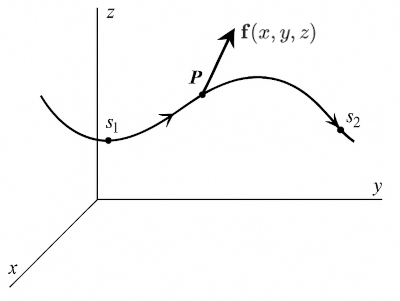

# Line Integrals and the Curl

### Work and Line Integrals
In one dimension, if force $F(x)$ acts from $x=a$ to $x=b$, the work done is:

$$
\int_a^b F(x) \\, dx
$$

To be able to handle more general cases, we introduce the concept of the line integral.

Suppose we have a curve $C$ in 3-dimensions and $s$ is the arc length from some arbitrary point
on the curve. If $f(x,y,z)$ is a function defined on the curve, then the line integral of $f$ along $C$ is:

$$
\int_C f(x,y,z) \\, ds
$$

If the curve is parameterized by arc length $s$, then we can express the line integral as:

$$
\int_C f(x,y,z) \\, ds = \int_{s_1}^{s_2} f(x(s),y(s),z(s)) \\, ds
$$

The value of the line integral can depend on the path taken between two points, not just the endpoints.

### Line Integrals Involving a Vector Field

Work, in most elementary sense, is force times displacement. Consider the curve below,
and assume that the object moves along the curve from point $s_1$ to $s_2$. Let the force
acting on the object be given by a vector field $\mathbf{f}(x,y,z)$.

 

Let $\hat{\mathbf{t}}$ be the unit tangent vector to the curve at $P$. The component of the force acting along the curve is $\mathbf{f} \cdot \hat{\mathbf{t}}$. Then the work done by the force in moving the object from $s_1$ to $s_2$ along the curve $C$ is:

$$
W = \int_C \mathbf{f}(x,y,z) \cdot \hat{\mathbf{t}} \\, ds
$$

To evaluate this, we need to be able to find $\hat{\mathbf{t}}$.

Assume that the curve is parametrized as $(x(s), y(s), z(s))$. It turns out that
the $\hat{\mathbf{t}}$ can be calculated as:

$$
\hat{\mathbf{t}} = \mathbf{i} \frac{dx}{ds} + \mathbf{j} \frac{dy}{ds} + \mathbf{k} \frac{dz}{ds}
$$

Then the work done can be expressed as:

$$
\begin{align*}
W &= \int_C \mathbf{f}(x,y,z) \cdot \left( \mathbf{i} \frac{dx}{ds} + \mathbf{j} \frac{dy}{ds} + \mathbf{k} \frac{dz}{ds} \right) ds \\\\[1em]
&= \int_C \left( f_x dx + f_y dy + f_z dz \right)
\end{align*}
$$
