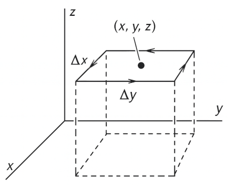
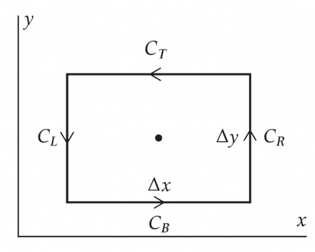
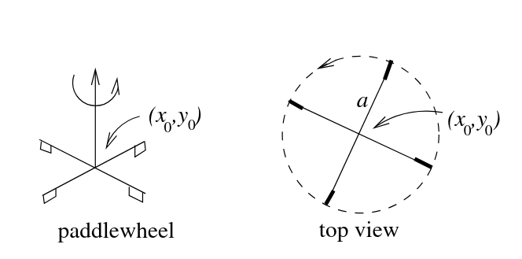

# Line Integrals and the Curl

### Work and Line Integrals
In one dimension, if force $F(x)$ acts from $x=a$ to $x=b$, the work done is:

$$
\int_a^b F(x) \\, dx
$$

To be able to handle more general cases, we introduce the concept of the line integral.

Suppose we have a curve $C$ in 3-dimensions and $s$ is the arc length from some arbitrary point
on the curve. If $f(x,y,z)$ is a function defined on the curve, then the line integral of $f$ along $C$ is:

$$
\int_C f(x,y,z) \\, ds
$$

If the curve is parameterized by arc length $s$, then we can express the line integral as:

$$
\int_C f(x,y,z) \\, ds = \int_{s_1}^{s_2} f(x(s),y(s),z(s)) \\, ds
$$

The value of the line integral can depend on the path taken between two points, not just the endpoints.

### Line Integrals Involving a Vector Field

Work, in most elementary sense, is force times displacement. Consider the curve below,
and assume that the object moves along the curve from point $s_1$ to $s_2$. Let the force
acting on the object be given by a vector field $\mathbf{f}(x,y,z)$.

 

Let $\hat{\mathbf{t}}$ be the unit tangent vector to the curve at $P$. The component of the force acting along the curve is $\mathbf{f} \cdot \hat{\mathbf{t}}$. Then the work done by the force in moving the object from $s_1$ to $s_2$ along the curve $C$ is:

$$
W = \int_C \mathbf{f}(x,y,z) \cdot \hat{\mathbf{t}} \\, ds
$$

To evaluate this, we need to be able to find $\hat{\mathbf{t}}$.

Assume that the curve is parametrized as $(x(s), y(s), z(s))$. It turns out that
the $\hat{\mathbf{t}}$ can be calculated as:

$$
\hat{\mathbf{t}} = \mathbf{i} \frac{dx}{ds} + \mathbf{j} \frac{dy}{ds} + \mathbf{k} \frac{dz}{ds}
$$

Then the work done can be expressed as:

$$
\begin{align*}
W &= \int_C \mathbf{f}(x,y,z) \cdot \left( \mathbf{i} \frac{dx}{ds} + \mathbf{j} \frac{dy}{ds} + \mathbf{k} \frac{dz}{ds} \right) ds \\\\[1em]
&= \int_C \left( f_x dx + f_y dy + f_z dz \right)
\end{align*}
$$

### Path Independence

Suppose we have $q_0$ at the origin and $q_1$ at $(x, y, z)$. We want to calculate the work
done by the force between these two particles when moving $q_1$ to some point $(x', y', z')$.

The force acting on $q_1$ is given by:

$$
\mathbf{f} = \frac{k q_0 q_1}{r^2} \hat{\mathbf{r}}
$$

$\hat{\mathbf{r}}$ is in radial direction, then $\hat{\mathbf{r}} = \dfrac{\mathbf{i} x + \mathbf{j} y + \mathbf{k} z}{r}$.

From earlier discussion, $W = \int_C (f_x dx + f_y dy + f_z dz)$.

So,

$$
W = \int_C \frac{k q_0 q_1 (x dx + y dy + z dz)}{r^3}
$$

Since $r^2 = x^2 + y^2 + z^2$, then $dr = x dx + y dy + z dz$, and we have:

$$
W = \int_C \frac{k q_0 q_1}{r^2} \\, dr
$$

Then if we move $q_1$ from some point at distance $r_1$ from the origin to some point at distance $r_2$ from the origin, the work done is:

$$
W = \int_{r_1}^{r_2} \frac{k q_0 q_1}{r^2} \\, dr = k q_0 q_1 \left( \frac{1}{r_1} - \frac{1}{r_2} \right)
$$

So, **the work done is independent of the path taken**.

The path independence is caused by two properties of the Coulomb force:

1. It depends only on the distance between the two particles.
2. It acts along the line joining them.

As a consequence, if we move the particle in a closed path, the work done is zero:

$$
\oint_C \mathbf{F} \cdot \hat{\mathbf{t}} \\, ds = 0
$$

It follows that if $\mathbf{E}$ is an electrostatic field, we have:

$$
\oint_C \mathbf{E} \cdot \hat{\mathbf{t}} \\, ds = 0
$$

The path integral around a closed curve is often called a **circulation**.

### The Curl

Let us consider the circulation of $\mathbf{F}$ around a small rectangle parallel to the $xy$-plane:

 

The line integral can be broken into four parts: $C_B$ (bottom), $C_L$ (left), $C_T$ (top), and $C_R$ (right).

 

Since the rectangle is small, well approximate each integral by $\mathbf{F} \cdot \hat{\mathbf{t}}$ at the center of the segment multiplied by the length of the segment.

Then,

$$
\begin{align*}
\int_{C_B} \mathbf{F} \cdot \hat{\mathbf{t}} \\, ds &\approx F_x \left(x, y - \frac{\Delta y}{2}, z \right) \Delta x
\\\\[1em]
\int_{C_T} \mathbf{F} \cdot \hat{\mathbf{t}} \\, ds &\approx - F_x \left(x, y + \frac{\Delta y}{2}, z \right) \Delta x
\end{align*}
$$

The negative sign is because $dx/ds$ is $-1$ over $C_T$.

Then (after few steps):

$$
\lim_{\Delta S \to 0} \frac{1}{\Delta S} \int_{C_T+C_B} \left( \mathbf{F} \cdot \hat{\mathbf{t}} \right) ds = -\frac{\partial F_x}{\partial y}
$$

Similarly:

$$
\lim_{\Delta S \to 0} \frac{1}{\Delta S} \int_{C_L+C_R} \left( \mathbf{F} \cdot \hat{\mathbf{t}} \right) ds = \frac{\partial F_y}{\partial x}
$$

Combining these results, we have:

$$
\lim_{\Delta S \to 0} \frac{1}{\Delta S} \oint_C \mathbf{F} \cdot \hat{\mathbf{t}} \\, ds = \frac{\partial F_y}{\partial x} - \frac{\partial F_x}{\partial y}
$$

If our curve was an arbitrary shape, the result would still hold. But the result definitely
depens on the orientation.

If the curve were parallel to the $xz$-plane, we would get $\dfrac{\partial F_x}{\partial z} - \dfrac{\partial F_z}{\partial x}$, and if it were parallel to the $yz$-plane, we would get $\dfrac{\partial F_z}{\partial y} - \dfrac{\partial F_y}{\partial z}$.

Each of these orientations can be identified using the normal vector to the surface containing the curve, when using the right-hand rule:

- Curve parallel to $yz$, Normal vector $\mathbf{i}$: $\dfrac{\partial F_z}{\partial y} - \dfrac{\partial F_y}{\partial z}$
- Curve parallel to $xy$, Normal vector $\mathbf{j}$: $\dfrac{\partial F_x}{\partial z} - \dfrac{\partial F_z}{\partial x}$
- Curve parallel to $xz$, Normal vector $\mathbf{k}$: $\dfrac{\partial F_y}{\partial x} - \dfrac{\partial F_x}{\partial y}$

Putting these as components of a vector, we have:

$$
\text{curl} \\, \mathbf{F} = \mathbf{i} \left( \frac{\partial F_z}{\partial y} - \frac{\partial F_y}{\partial z} \right) + \mathbf{j} \left( \frac{\partial F_x}{\partial z} - \frac{\partial F_z}{\partial x} \right) + \mathbf{k} \left( \frac{\partial F_y}{\partial x} - \frac{\partial F_x}{\partial y} \right)
$$

:::card[note]
**Definition of Curl**: Limit of the circulation to area as area shrinks to zero.

To be more precise, let $\oint_{C_n} \mathbf{F} \cdot \hat{\mathbf{t}} \\, ds$ be the circulation of $\mathbf{F}$ around a curve whose normal is $\hat{\mathbf{n}}$. Then by definition,

$$
\mathbf{\hat{n}} \cdot \text{curl} \\, \mathbf{F} = \lim_{\Delta S \to 0} \frac{1}{\Delta S} \oint_{C_n} \mathbf{F} \cdot \hat{\mathbf{t}} \\, ds
$$

:::

This can be written as a determinant:

$$
\text{curl} \\, \mathbf{F} = \begin{vmatrix}
\mathbf{i} & \mathbf{j} & \mathbf{k} \\\\[0.5em]
\dfrac{\partial}{\partial x} & \dfrac{\partial}{\partial y} & \dfrac{\partial}{\partial z} \\\\[0.5em]
F_x & F_y & F_z
\end{vmatrix}
$$

When written in del operator notation:

$$
\text{curl} \\, \mathbf{F} = \nabla \times \mathbf{F}
$$

### The Meaning of the Curl

Suppose some particle moving in a circular path, with $x = r \cos \omega t$, $y = r \sin \omega t$, and $z = 0$.

Then the velocity is:

$$
\mathbf{v} = - \mathbf{i}\\, r \omega \sin \omega t + \mathbf{j}\\, r \omega \cos \omega t
= \omega (-\mathbf{i} y + \mathbf{j} x)
$$

The curl of the velocity is:

$$
\nabla \times \mathbf{v} = 2 \mathbf{k} \omega
$$

We observe that the curl is a vector pointing along the axis of rotation, with a magnitude proportional to the angular velocity $\omega$.

To visualize the curl of a vector field at a point, imagine placing a tiny paddlewheel at that location. If the surrounding flow causes the paddlewheel to spin, then the field has a nonzero curl there.

 

Diagram was taken from: [MIT OCW's 18-02sc, Physical meaning of curl](https://ocw.mit.edu/courses/18-02sc-multivariable-calculus-fall-2010/d18774dd8a3f24001bf3d502fef7f854_MIT18_02SC_MNotes_v4.3.pdf), licensed under a [Creative Commons Attribution-NonCommercial-ShareAlike 4.0 International License](https://creativecommons.org/licenses/by-nc-sa/4.0/)

### Differential Form of the Circulation Law

If $\mathbf{E}$ is an electrostatic field, then for any closed curve $C$:

$$
\oint_C \mathbf{E} \cdot \hat{\mathbf{t}} \\, ds = 0
$$

It follows that:

$$
\hat{\mathbf{n}} \cdot \nabla \times \mathbf{E} = 0
$$

Since $C$ is arbitrary, we can conclude that:

$$
\nabla \times \mathbf{E} = 0
$$

Then the answer to the question "Can a given vector field $F(x,y,z)$ be an electrostatic field?" is:

- If $\nabla \times \mathbf{F} = 0$, then $\mathbf{F}$ can be an electrostatic field.
- If $\nabla \times \mathbf{F} \neq 0$, then $\mathbf{F}$ cannot be an electrostatic field.

### Stokes' Theorem

Stokes' theorem relates:
- The **line integral** of a vector field $\mathbf{F}$ around a closed curve $C$.
- The **surface integral** of the normal component of the curl of $\mathbf{F}$ over
  any capping surface $S$ of $C$.

$$
\oint_C \mathbf{F} \cdot \hat{\mathbf{t}} \\, ds = \iint_S \nabla \times \mathbf{F} \cdot \hat{\mathbf{n}} \\, dS
$$

### Ampere's Circuital Law

Setup:
 - Closed loop $C$ enclosing a current $I$.
 - Direction of $C$ and $I$: right-hand rule.

Then:

$$
\oint_C \mathbf{B} \cdot \hat{\mathbf{t}} \, ds = \mu_0 I
$$

Introduce current density $\mathbf{J}$:

$$
\Delta I = \mathbf{J} \cdot \hat{\mathbf{n}} \, \Delta S
$$

Then total current flowing through $S$ is:

$$
\iint_S \mathbf{J} \cdot \hat{\mathbf{n}} \, dS
$$

Thus Ampere's circuital law can be written as:

$$
\oint_C \mathbf{B} \cdot \hat{\mathbf{t}} \, ds = \mu_0 \iint_S \mathbf{J} \cdot \hat{\mathbf{n}} \, dS
$$

where $S$ is any capping surface of $C$.

Using Stokes' theorem, we can write:

$$
\iint_C \nabla \times \mathbf{B} \cdot \hat{\mathbf{n}} \, dS = \mu_0 \iint_S \mathbf{J} \cdot \hat{\mathbf{n}} \, dS
$$

Since this is true for any surface $S$ capping $C$, we can conclude that:

$$
\nabla \times \mathbf{B} = \mu_0 \mathbf{J}
$$

This is Ampere's law in differential form.
