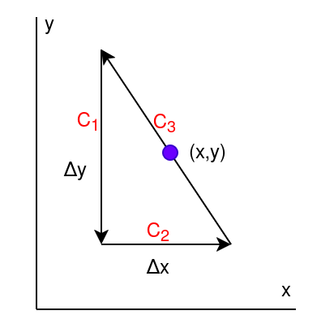
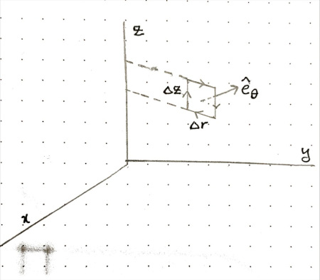
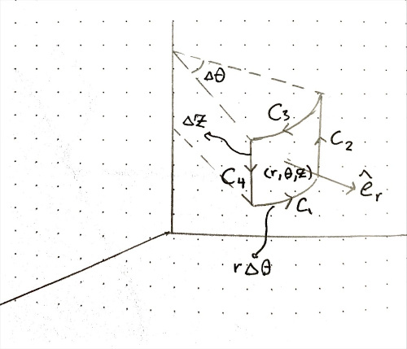
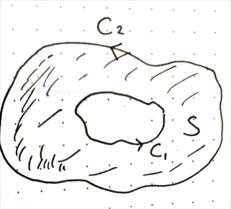
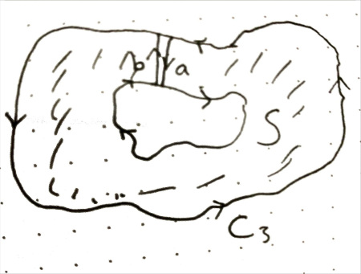
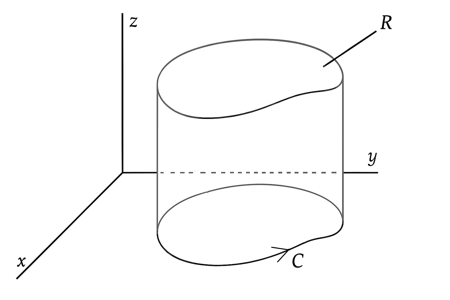
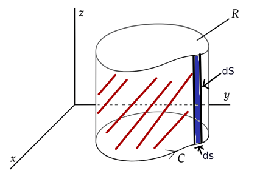
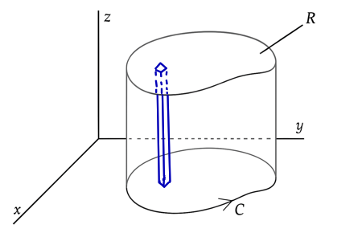
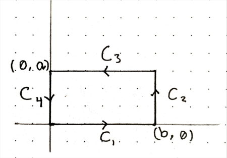
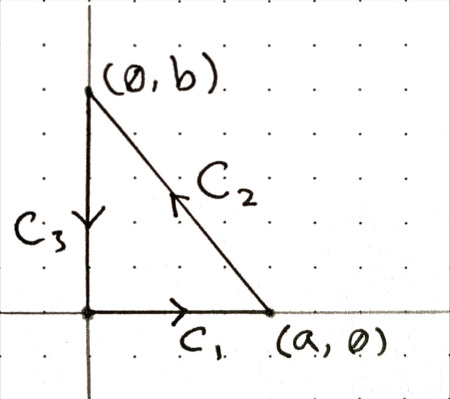

# Problems for Chapter 3

**Problem III-1.**
Use an argument like the one given in the text for the Coloumb force to
show that $\int_C \mathbf{F} \cdot \hat{\mathbf{t}} \\, ds = 0$ is independent
of path for any central force $\mathbf{F}$.

:::expandable
**Solution.** [Click to Expand]

If $\mathbf{F}$ is a central force, then for any point $P$ in space, the force is in
the radial direction and its magnitude depends only on the distance $r$ from the origin:

$$
\mathbf{F} = F_r(r) \hat{\mathbf{e}}_r
$$

Then we have:

$$
\begin{align*}
F_x &= F_r(r) \sin \phi \cos \theta \\\\
F_y &= F_r(r) \sin \phi \sin \theta \\\\
F_z &= F_r(r) \cos \phi
\end{align*}
$$

and since:

$$
\begin{align*}
x &= r \sin \phi \cos \theta \\\\
y &= r \sin \phi \sin \theta \\\\
z &= r \cos \phi
\end{align*}
$$

We have:

$$
\begin{align*}
dx &= \sin \phi \cos \theta \\, dr + r \cos \phi \cos \theta \\, d\phi - r \sin \phi \sin \theta \\, d\theta \\\\
dy &= \sin \phi \sin \theta \\, dr + r \cos \phi \sin \theta \\, d\phi + r \sin \phi \cos \theta \\, d\theta \\\\
dz &= \cos \phi \\, dr - r \sin \phi \\, d\phi
\end{align*}
$$

Then:

$$
\begin{align*}
F_x \\, dx &+ F_y \\, dy + F_z \\, dz = \\\\
& F_r(r) (\sin^2 \phi \cos^2 \theta + \sin^2 \phi \sin^2 \theta + \cos^2 \phi) \\, dr + \\\\
& F_r(r) (r \sin \phi \cos \phi \cos^2 \theta + r \sin \phi \cos \phi \sin^2 \theta - r \sin \phi \cos \phi) \\, d\phi + \\\\
& F_r(r) (-r \sin^2 \phi \sin \theta \cos \theta + r \sin^2 \phi \sin \theta \cos \theta) \\, d\theta
\end{align*}
$$

Which simplifies to:

$$
F_x \\, dx + F_y \\, dy + F_z \\, dz = F_r(r) \\, dr
$$

On page 68 we saw that:

$$
\int_C \mathbf{F} \cdot \hat{\mathbf{t}} \\, ds = \int_C (F_x \\, dx + F_y \\, dy + F_z \\, dz) 
$$

Thus, we have:

$$
\begin{align*}
\int_C \mathbf{F} \cdot \hat{\mathbf{t}} \\, ds &= \int_C F_r(r) \\, dr \\\\
 &= \int_{r_1}^{r_2} F_r(r) \\, dr
\end{align*}
$$

which is independent of the path taken and depends only on the initial and final radius.

::::

---------------

**Problem III-2.**
In the text we obtained the result

$$
(\nabla \times \mathbf{F})_z = \frac{\partial F_y}{\partial x} - \frac{\partial F_x}{\partial y}
$$

by integrating over a small rectanglular path. As an example of the fact that this result
is independent of the path, rederive it, using a triangular path.

:::expandable
**Solution.** [Click to Expand]

 

Assume the force $\mathbf{F}$ is given by:

$$
\mathbf{F} = F_x \mathbf{i} + F_y \mathbf{j} + F_z \mathbf{k}
$$

In the text on page 68 we saw that:

$$
\int_C \mathbf{F} \cdot \hat{\mathbf{t}} \\, ds = \int_C (F_x \\, dx + F_y \\, dy + F_z \\, dz)
$$

Then for $C_1$, we have:

$$
\begin{align*}
\int_{C_1} \mathbf{F} \cdot \hat{\mathbf{t}} \\, ds &= \int_{y + \Delta y / 2}^{y - \Delta y / 2} F_y\left(x - \frac{\Delta x}{2} , u\right) \\, du
\\\\[1em]
& \approx -F_y\left(x - \frac{\Delta x}{2} , y\right) \Delta y
\end{align*}
$$

and for $C_2$, we have:

$$
\begin{align*}
\int_{C_2} \mathbf{F} \cdot \hat{\mathbf{t}} \\, ds &= \int_{x - \Delta x / 2}^{x + \Delta x / 2} F_x\left(u, y - \frac{\Delta y}{2}\right) \\, du
\\\\[1em]
& \approx F_x\left(x, y - \frac{\Delta y}{2}\right) \Delta x
\end{align*}
$$

and for $C_3$, we have:

$$
\begin{align*}
\int_{C_3} \mathbf{F} \cdot \hat{\mathbf{t}} \\, ds &= \int_{C_3} \left( F_x \, dx + F_y \\, dy \right) \\\\[1em]
&= \int_{x + \Delta x / 2}^{x - \Delta x / 2} F_x\left(u, y(u)\right) \\, du +
\int_{y - \Delta y / 2}^{y + \Delta y / 2} F_y\left(x(u), u\right) \\, du
\\\\[1em]
& \approx -F_x\left(x, y\right) \Delta x + F_y\left(x, y\right) \Delta y
\end{align*}
$$

Thus, we have:

$$
\begin{align*}
\int_{C_1+C_2+C_3} \mathbf{F} &\cdot \hat{\mathbf{t}} \\, ds \approx \\\\[0.5em]
&\Delta y \left( F_y(x, y) - F_y\left(x - \frac{\Delta x}{2}, y\right) \right) + \\\\[0.5em]
&\Delta x \left( F_x\left(x, y - \frac{\Delta y}{2}\right) - F_x(x, y) \right)
\end{align*}
$$

Since $\Delta A = \dfrac{\Delta x \Delta y}{2}$, we have:

$$
\begin{align*}
\frac{1}{\Delta A} \int_{C_1+C_2+C_3} \mathbf{F} &\cdot \hat{\mathbf{t}} \\, ds \approx \\\\[0.5em]
& \frac{F_y(x, y) - F_y\left(x - \frac{\Delta x}{2}, y\right)}
{\Delta x / 2} - \\\\[0.5em]
&\frac{F_x(x, y) - F_x\left(x, y - \frac{\Delta y}{2}\right)}{\Delta y / 2}
\end{align*}
$$

So, we have:

$$
\lim_{\Delta A \to 0} \frac{1}{\Delta A} \int_{C_1+C_2+C_3} \mathbf{F} \cdot \hat{\mathbf{t}} \\, ds =
\frac{\partial F_y}{\partial x} - \frac{\partial F_x}{\partial y}
$$
::::

---------------

**Problem III-7.** Show that $\nabla \cdot (\nabla \times \mathbf{F}) = 0$. (Assume that
mixed second partial derivatives are independent of the order of differentiation.)

:::expandable
**Solution.** [Click to Expand]

$$
\begin{align*}
\nabla \times \mathbf{F} &= \mathbf{i} \left( \frac{\partial F_z}{\partial y} - \frac{\partial F_y}{\partial z} \right) \\\\
&+ \mathbf{j} \left( \frac{\partial F_x}{\partial z} - \frac{\partial F_z}{\partial x} \right) \\\\
&+ \mathbf{k} \left( \frac{\partial F_y}{\partial x} - \frac{\partial F_x}{\partial y} \right)
\end{align*}
$$

Then:

$$
\begin{align*}
\nabla \cdot (\nabla \times \mathbf{F}) &= \frac{\partial F_z}{\partial x \partial y} -
\frac{\partial F_y}{\partial x \partial z} \\\\
&+ \frac{\partial F_x}{\partial y \partial z} - \frac{\partial F_z}{\partial x \partial y} \\\\
&+ \frac{\partial F_y}{\partial x \partial z} - \frac{\partial F_x}{\partial y \partial z} \\\\
&= 0
\end{align*}
$$
::::

---------------

**Problem III-8.** In the text we obtained the $z$-component of $\nabla \times \mathbf{F}$ 
in cylindrical coordinates. Proceeding the same way, obtain the $\theta$- and $r$-components.

:::expandable
**Solution ($\theta$-component).** [Click to Expand]

Using the path shown in the figure, we'll yield the $\theta$-component of $\nabla \times \mathbf{F}$ in cylindrical coordinates.

 

Viewed from above:

 

For $C_1$, we have $\hat{\mathbf{t}} = \hat{\mathbf{e}_r}$ and $ds = dr$. Then:

$$
\begin{align*}
\int_{C_1} \mathbf{F} \cdot \hat{\mathbf{t}} \\, ds &= \int_{r - \Delta r / 2}^{r + \Delta r / 2} F_r(u, \theta, z - \frac{\Delta z}{2}) \\, du \\\\[1em]
&\approx F_r(r, \theta, z - \frac{\Delta z}{2}) \Delta r
\end{align*}
$$

For $C_2$, we have $\hat{\mathbf{t}} = \mathbf{\mathbf{e}_z}$ and $ds = dz$. Then:

$$
\begin{align*}
\int_{C_2} \mathbf{F} \cdot \hat{\mathbf{t}} \\, ds &= \int_{z - \Delta z / 2}^{z + \Delta z / 2} F_z(r + \Delta r / 2, \theta, u) \\, du \\\\[1em]
&\approx F_z(r + \frac{\Delta r}{2}, \theta, z) \Delta z
\end{align*}
$$

For $C_3$, we have $\hat{\mathbf{t}} = -\hat{\mathbf{e}_r}$ and $ds = -dr$. Then:

$$
\begin{align*}
\int_{C_3} \mathbf{F} \cdot \hat{\mathbf{t}} \\, ds &= \int_{r + \Delta r / 2}^{r - \Delta r / 2} (-F_r(u, \theta, z + \frac{\Delta z}{2})) \\, (-du) \\\\[1em]
&\approx -F_r(r, \theta, z + \frac{\Delta z}{2}) \Delta r
\end{align*}
$$

For $C_4$, we have $\hat{\mathbf{t}} = -\hat{\mathbf{e}_z}$ and $ds = -dz$. Then:

$$
\begin{align*}
\int_{C_4} \mathbf{F} \cdot \hat{\mathbf{t}} \\, ds &= \int_{z + \Delta z / 2}^{z - \Delta z / 2} (-F_z(r - \Delta r / 2, \theta, u)) \\, (-du) \\\\[1em]
&\approx -F_z(r - \frac{\Delta r}{2}, \theta, z) \Delta z
\end{align*}
$$

Then, we have:

$$
\begin{align*}
\int_{C_1 + C_2 + C_3 + C_4} \mathbf{F} &\cdot \hat{\mathbf{t}} \\, ds \approx \\\\[0.5em]
&\Delta r \left( F_r(r, \theta, z - \frac{\Delta z}{2}) - F_r(r, \theta, z + \frac{\Delta z}{2}) \right) + \\\\[0.5em]
&\Delta z \left( F_z(r + \frac{\Delta r}{2}, \theta, z) - F_z(r - \frac{\Delta r}{2}, \theta, z) \right)
\end{align*}
$$

Since $\Delta A = \Delta r \Delta z$, we have:

$$
\begin{align*}
\frac{1}{\Delta A} \int_{C_1 + C_2 + C_3 + C_4} \mathbf{F} &\cdot \hat{\mathbf{t}} \\, ds \approx \\\\[0.5em]
& \frac{F_r(r, \theta, z - \dfrac{\Delta z}{2}) - F_r(r, \theta, z + \dfrac{\Delta z}{2})}
{\Delta z} - \\\\[0.5em]
&\frac{F_z(r + \dfrac{\Delta r}{2}, \theta, z) - F_z(r - \dfrac{\Delta r}{2}, \theta, z)}{\Delta r}
\end{align*}
$$

So, $\theta$-component of $\nabla \times \mathbf{F}$ is:

$$
\lim_{\Delta A \to 0} \frac{1}{\Delta A} \int_{C_1 + C_2 + C_3 + C_4} \mathbf{F} \cdot \hat{\mathbf{t}} \\, ds =
\frac{\partial F_r}{\partial z} - \frac{\partial F_z}{\partial r}
$$

::::

:::expandable
**Solution ($r$-component).** [Click to Expand]

Using the path shown in the figure, we'll yield the $r$-component of $\nabla \times \mathbf{F}$ in cylindrical coordinates.

 

For $C_1$, we have $\hat{\mathbf{t}} = \hat{\mathbf{e}_\theta}$ and $ds = r d\theta$. Then:

$$
\begin{align*}
\int_{C_1} \mathbf{F} \cdot \hat{\mathbf{t}} \\, ds &= \int_{\theta - \Delta \theta / 2}^{\theta + \Delta \theta / 2} F_\theta(r, u, z - \frac{\Delta z}{2}) \\, r \\, du \\\\[1em]
&\approx F_\theta(r, \theta, z - \frac{\Delta z}{2}) r \Delta \theta
\end{align*}
$$

For $C_2$, we have $\hat{\mathbf{t}} = \hat{\mathbf{e}_z}$ and $ds = dz$. Then:

$$
\begin{align*}
\int_{C_2} \mathbf{F} \cdot \hat{\mathbf{t}} \\, ds &= \int_{z - \Delta z / 2}^{z + \Delta z / 2} F_z(r, \theta + \frac{\Delta \theta}{2}, u) \\, du \\\\[1em]
&\approx F_z(r, \theta + \frac{\Delta \theta}{2}, z) \Delta z
\end{align*}
$$

For $C_3$, we have $\hat{\mathbf{t}} = -\hat{\mathbf{e}_\theta}$ and $ds = -r d\theta$. Then:

$$
\begin{align*}
\int_{C_3} \mathbf{F} \cdot \hat{\mathbf{t}} \\, ds &= \int_{\theta + \Delta \theta / 2}^{\theta - \Delta \theta / 2} (-F_\theta(r, u, z + \frac{\Delta z}{2})) \\, (-r \\, du) \\\\[1em]
&\approx -F_\theta(r, \theta, z + \frac{\Delta z}{2}) r \Delta \theta
\end{align*}
$$

For $C_4$, we have $\hat{\mathbf{t}} = -\hat{\mathbf{e}_z}$ and $ds = -dz$. Then:

$$
\begin{align*}
\int_{C_4} \mathbf{F} \cdot \hat{\mathbf{t}} \\, ds &= \int_{z + \Delta z / 2}^{z - \Delta z / 2} (-F_z(r, \theta - \frac{\Delta \theta}{2}, u)) \\, (-du) \\\\[1em]
&\approx -F_z(r, \theta - \frac{\Delta \theta}{2}, z) \Delta z
\end{align*}
$$

Then, we have:

$$
\begin{align*}
\int_{C_1 + C_2 + C_3 + C_4} \mathbf{F} &\cdot \hat{\mathbf{t}} \\, ds \approx \\\\[0.5em]
&r \\, \Delta \theta \left( F_\theta(r, \theta, z - \frac{\Delta z}{2}) - F_\theta(r, \theta, z + \frac{\Delta z}{2}) \right) + \\\\[0.5em]
&\Delta z \left( F_z(r, \theta + \frac{\Delta \theta}{2}, z) - F_z(r, \theta - \frac{\Delta \theta}{2}, z) \right)
\end{align*}
$$

Since $\Delta A = r \Delta \theta \Delta z$, we have:

$$
\begin{align*}
\frac{1}{\Delta A} \int_{C_1 + C_2 + C_3 + C_4} \mathbf{F} &\cdot \hat{\mathbf{t}} \\, ds \approx \\\\[0.5em]
& \frac{F_z(r, \theta + \dfrac{\Delta \theta}{2}, z) - F_z(r, \theta - \dfrac{\Delta \theta}{2}, z)}
{r \\, \Delta \theta} - \\\\[0.5em]
&\frac{F_\theta(r, \theta, z + \dfrac{\Delta z}{2}) - F_\theta(r, \theta, z - \dfrac{\Delta z}{2})}{\Delta z}
\end{align*}
$$

So, $r$-component of $\nabla \times \mathbf{F}$ is:

$$
\lim_{\Delta A \to 0} \frac{1}{\Delta A} \int_{C_1 + C_2 + C_3 + C_4} \mathbf{F} \cdot \hat{\mathbf{t}} \\, ds =
\frac{1}{r} \\, \frac{\partial F_z}{\partial \theta} - \frac{\partial F_{\theta}}{\partial z}
$$

::::

---------------

**Problem III-14.** Use Stokes' theorem to show that

$$
\oint_C \hat{\mathbf{t}} \\, ds = 0
$$

:::expandable
**Solution.** [Click to Expand]

Using $\nabla \times \mathbf{F} = \mathbf{i} \left( \frac{\partial{F_z}}{\partial y} - \frac{\partial{F_y}}{\partial z} \right) + \mathbf{j} \left( \frac{\partial{F_x}}{\partial z} - \frac{\partial{F_z}}{\partial x} \right) + \mathbf{k} \left( \frac{\partial{F_y}}{\partial x} - \frac{\partial{F_x}}{\partial y} \right)$, we get:
$\nabla \times \mathbf{i}$ = $\nabla \times \mathbf{j}$ = $\nabla \times \mathbf{k} = 0$.

Then, $i$-component of $\oint_C \hat{\mathbf{t}} \\, ds$ is:

$$
\begin{align*}
\mathbf{i} \cdot \oint_C \hat{\mathbf{t}} \\, ds &= \oint_C \mathbf{i} \cdot \hat{\mathbf{t}} \\, ds \\\\
&= \iint_S \nabla \times \mathbf{i} \cdot \hat{\mathbf{n}} \\, dS \\\\
&= 0
\end{align*}
$$

Similarly, we can show that $j$-component and $k$-component of $\oint_C \hat{\mathbf{t}} \\, ds$ are also zero.

Then, we have:

$$
\oint_C \hat{\mathbf{t}} \\, ds = 0
$$
::::

---------------

**Problem III-16.**

**(a)** Consider a vector function with the property $\nabla \times \mathbf{F} = 0$ everywhere on two closed curves $C_1$ and $C_2$ and on any capping surface $S$ of the
region enclosed by them. Show that the circulation of $\mathbf{F}$ around $C_1$ equals
the circulation of $\mathbf{F}$ around $C_2$.

 

:::expandable
**Solution.** [Click to Expand]

Form $C_3$ by joining $C_1$ and $C_2$ with a segment on $S$ and reversing the direction of $C_1$.

In figure below $a$ and $b$ segments completly overlap but in opposite directions. They concect
inner and outer parts of the curve by moving along $S$.

 

Then $S$ is a capping surface for the region enclosed by $C_3$.

Then, we have:

$$
\oint_{C_3} \mathbf{F} \cdot \hat{\mathbf{t}} \\, ds = \iint_S \nabla \times \mathbf{F} \cdot \hat{\mathbf{n}} \\, dS
$$

Since $\nabla \times \mathbf{F} = 0$, we have:

$$
\oint_{C_3} \mathbf{F} \cdot \hat{\mathbf{t}} \\, ds = 0 \tag{1}
$$

Since we have reversed the direction of $C_1$ and line integrals along $a$ and $b$ cancel each other, we have:

$$
\oint_{C_3} \mathbf{F} \cdot \hat{\mathbf{t}} \\, ds = -\oint_{C_1} \mathbf{F} \cdot \hat{\mathbf{t}} \\, ds + \oint_{C_2} \mathbf{F} \cdot \hat{\mathbf{t}} \\, ds \tag{2}
$$

Putting (1) and (2) together, we have:

$$
-\oint_{C_1} \mathbf{F} \cdot \hat{\mathbf{t}} \\, ds + \oint_{C_2} \mathbf{F} \cdot \hat{\mathbf{t}} \\, ds = 0
$$

Thus, we have:

$$
\oint_{C_1} \mathbf{F} \cdot \hat{\mathbf{t}} \\, ds = \oint_{C_2} \mathbf{F} \cdot \hat{\mathbf{t}} \\, ds
$$
::::

**(b)** The magentic field due to an infinitely long straight wire carrying a uniform current
$I$ is $\mathbf{B} = (\mu_0 I / 2 \pi r) \hat{\mathbf{e}_\theta}$. Show that $\nabla \times \mathbf{B} = 0$ everywhere except at $r = 0$.

:::expandable
**Solution.** [Click to Expand]

$$
\begin{align*}
(\nabla \times \mathbf{B})\_r &= \frac{1}{r} \frac{\partial F_z}{\partial \theta} - \frac{\partial F_\theta}{\partial z} \\\\[0.8em]
&= - \frac{\partial}{\partial z} \left( \frac{\mu_0 I}{2 \pi r} \right) \\\\[0.5em]
&= 0 \\\\[1.5em]
(\nabla \times \mathbf{B})\_\theta &= \frac{\partial F_r}{\partial z} - \frac{\partial F_z}{\partial r} \\\\[0.5em]
&= 0 \\\\[1.5em]
(\nabla \times \mathbf{B})\_z &= \frac{1}{r} \frac{\partial}{\partial r}(r F_\theta) - \frac{\partial F_r}{\partial \theta} \\\\[1em]
&= \frac{1}{r} \frac{\partial}{\partial r} \left( r \frac{\mu_0 I}{2 \pi r} \right)\\\\[1em]
&= \frac{1}{r} \frac{\partial}{\partial r} \left( \frac{\mu_0 I}{2 \pi} \right) \\\\[0.5em]
&= 0
\end{align*}
$$

::::

**(c)** Prove Ampere's circuital law for the field of the wire given in part (b).

:::expandable
**Solution.** [Click to Expand]

For a circle of radius $r$, $ds = r \\, d\theta$ and $\hat{\mathbf{t}} = \hat{\mathbf{e}_\theta}$. Then, we have:

$$
\oint_{circle} \mathbf{B} \cdot \hat{\mathbf{t}} \\, ds = \int_{0}^{2 \pi} \frac{\mu_0 I}{2 \pi r} r \\, d\theta = \mu_0 I
$$

For any curve $C$ not passing through the wire, there exists a circle around the wire inside it.
Putting together the results from part (a) and (b), circulation of $\mathbf{B}$ around $C$ is equal to the circulation of $\mathbf{B}$ around the circle, which is $\mu_0 I$.

So, for any curve $C$ not passing through the wire, we have:

$$
\oint_C \mathbf{B} \cdot \hat{\mathbf{t}} \\, ds = \mu_0 I
$$

::::

-----------------

**Problem III-18.** The electromotive force $\mathcal{E}$ in a circuit $C$ is equal to the
circulation of the electric field $\mathbf{E}$ around the circuit:

$$
\mathcal{E} = \oint_C \mathbf{E} \cdot \hat{\mathbf{t}} \\, ds
$$

Faraday discovered that in a stationary circuit an electromotive force is induced by a 
changing magnetic flux. That is,

$$
\mathcal{E} = - \frac{d \Phi}{dt}
$$

where

$$
\Phi = \iint_S \mathbf{B} \cdot \hat{\mathbf{n}} \\, dS
$$

$t$ is time (don't confuse it with the tangent vector $\hat{\mathbf{t}}$) and $S$ is
any capping surface of $C$. Use this information and Stokes' theorem to derive the
equation

$$
\nabla \times \mathbf{E} = - \frac{\partial \mathbf{B}}{\partial t}
$$

which is one of Maxwell's equations.

:::expandable
**Solution.** [Click to Expand]

Since $\mathcal{E} = \oint_C \mathbf{E} \cdot \hat{\mathbf{t}} \\, ds$, then for any
capping surface $S$ of $C$, we have:

$$
\mathcal{E} = \iint_S \nabla \times \mathbf{E} \cdot \hat{\mathbf{n}} \\, dS \tag{1}
$$

Differentiating $\Phi = \iint_S \mathbf{B} \cdot \hat{\mathbf{n}} \\, dS$ with respect to $t$, we have:

$$
\frac{d \Phi}{d t} = \iint_S \frac{\partial \mathbf{B}}{\partial t} \cdot \hat{\mathbf{n}} \\, dS
$$

Where we used the fact that $S$ is stationary, so $\hat{\mathbf{n}}$ does not depend on $t$.

From the problem statement we know that $\mathcal{E} = - \dfrac{d \Phi}{dt}$. Then, we have:

$$
\mathcal{E} = - \iint_S \frac{\partial \mathbf{B}}{\partial t} \cdot \hat{\mathbf{n}} \\, dS \tag{2}
$$

Putting (1) and (2) together, we have:

$$
\iint_S \nabla \times \mathbf{E} \cdot \hat{\mathbf{n}} \\, dS = - \iint_S \frac{\partial \mathbf{B}}{\partial t} \cdot \hat{\mathbf{n}} \\, dS
$$

Since this is true for any capping surface $S$ of $C$, we have:

$$
\nabla \times \mathbf{E} = - \frac{\partial \mathbf{B}}{\partial t}
$$
::::

-----------------

**Problem III-19.** Determine the value of the line integral $\int_C \mathbf{F} \cdot \hat{\mathbf{t}} \\, ds$, where

$$
\mathbf{F} = (e^{-y} - z e^{-x}) \mathbf{i} + (e^{-z} - x e^{-y}) \mathbf{j} + (e^{-x} - y e^{-z}) \mathbf{k}
$$

and $C$ is the path

$$
\begin{cases}
x = \dfrac{1}{\ln 2} \ln(1 + p), \\\\
y = \sin\left(\dfrac{\pi p}{2}\right), \\\\
z = \dfrac{1 - e^p}{1 - e},
\end{cases}
\quad 0 \leq p \leq 1
$$

from $(0, 0, 0)$ to $(1, 1, 1)$.

:::expandable
**Solution.** [Click to Expand]

Since $\nabla \times \mathbf{F} = 0$, the line integral is independent of the path taken.

Then we can use:
 - $C_1$: straight segment from $(0, 0, 0)$ to $(1, 0, 0)$,
 - $C_2$: straight segment from $(1, 0, 0)$ to $(1, 1, 0)$,
 - $C_3$: straight segment from $(1, 1, 0)$ to $(1, 1, 1)$.

Then we have:

$$
\begin{align*}
\int_{C_1} \mathbf{F} \cdot \hat{\mathbf{t}} \\, ds &= \int_{0}^{1} e^0 \\, dx = 1 \\\\[1em]
\int_{C_2} \mathbf{F} \cdot \hat{\mathbf{t}} \\, ds &= \int_{0}^{1} (1 - e^{-y}) \\, dy = e^{-1} \\\\[1em]
\int_{C_3} \mathbf{F} \cdot \hat{\mathbf{t}} \\, ds &= \int_{0}^{1} (e^{-1} - e^{-z}) \\, dz = 2 e^{-1} - 1
\end{align*}
$$

Then, we have:

$$
\int_C \mathbf{F} \cdot \hat{\mathbf{t}} \\, ds =  \int_{C_1 + C_2 + C_3} \mathbf{F} \cdot \hat{\mathbf{t}} \\, ds = 3 e^{-1}
$$

::::

------------------

**Problem III-20.** Maxwell's equations are:

$$
\begin{align*}
\nabla \cdot \mathbf{E} &= \frac{\rho}{\varepsilon_0} \tag{M1} \\\\
\nabla \cdot \mathbf{B} &= 0 \tag{M2} \\\\
\nabla \times \mathbf{E} &= - \frac{\partial \mathbf{B}}{\partial t} \tag{M3} \\\\
\nabla \times \mathbf{B} &= \varepsilon_0 \mu_0 \frac{\partial \mathbf{E}}{\partial t} + \mu_0 \mathbf{J} \tag{M4}
\end{align*}
$$

where $\mathbf{E}$ is the electric field, $\mathbf{B}$ is the magnetic field, $\rho$ is the charge density, and $\mathbf{J}$ is the current density. Use Maxwell's equations to derive the continuity equation

$$
\nabla \cdot \mathbf{J} + \frac{\partial \rho}{\partial t} = 0
$$

:::expandable
**Solution.** [Click to Expand]

**Lemma.** $\dfrac{\partial}{\partial t} \left( \nabla \cdot \mathbf{E} \right) = \nabla \cdot \left( \dfrac{\partial \mathbf{E}}{\partial t} \right)$.

**Proof of Lemma.** Let $\mathbf{E} = (E_x, E_y, E_z)$. Then

$$
\nabla \cdot \mathbf{E} = \dfrac{\partial E_x}{\partial x} + \dfrac{\partial E_y}{\partial y} + \dfrac{\partial E_z}{\partial z}
$$

Differentiating with respect to $t$, we have:

$$
\begin{align*}
\dfrac{\partial}{\partial t} \left( \nabla \cdot \mathbf{E} \right) &= \dfrac{\partial^2 E_x}{\partial x \partial t} + \dfrac{\partial^2 E_y}{\partial y \partial t} + \dfrac{\partial^2 E_z}{\partial z \partial t} \\\\[1em]
&= \nabla \cdot \left( \frac{\partial E_x}{\partial t}, \frac{\partial E_y}{\partial t}, \frac{\partial E_z}{\partial t} \right) \\\\[1em]
&= \nabla \cdot \left( \frac{\partial \mathbf{E}}{\partial t} \right)
\end{align*}
$$

**Proof of Continuity Equation.** From (M4) we have:

$$
\mu_0 \mathbf{J} = \nabla \times \mathbf{B} - \varepsilon_0 \mu_0 \frac{\partial \mathbf{E}}{\partial t}
$$

Taking the divergence of both sides and using the linearity of the divergence operator, we have:

$$
\mu_0 \left( \nabla \cdot \mathbf{J} \right) = \nabla \cdot \left( \nabla \times \mathbf{B} \right) - \varepsilon_0 \mu_0 \nabla \cdot \frac{\partial \mathbf{E}}{\partial t}
$$

In III.7 we proved that $\nabla \cdot \left( \nabla \times \mathbf{B} \right) = 0$. Then, we have:

$$
\mu_0 \left( \nabla \cdot \mathbf{J} \right) = - \varepsilon_0 \mu_0 \nabla \cdot \frac{\partial \mathbf{E}}{\partial t}
$$

which means:

$$
\nabla \cdot \mathbf{J} = - \varepsilon_0 \nabla \cdot \frac{\partial \mathbf{E}}{\partial t} \tag{1}
$$

Differentiating (M1) with respect to $t$, we have:

$$
\frac{\partial}{\partial t} \left( \nabla \cdot \mathbf{E} \right) = \frac{1}{\varepsilon_0} \frac{\partial \rho}{\partial t}
$$

Using the lemma, we have:

$$
\nabla \cdot \frac{\partial \mathbf{E}}{\partial t} = \frac{1}{\varepsilon_0} \frac{\partial \rho}{\partial t} \tag{2}
$$

Putting (1) and (2) together, we have:

$$
\nabla \cdot \mathbf{J} = - \frac{\partial \rho}{\partial t}
$$

Rearranging, we have:

$$
\nabla \cdot \mathbf{J} + \frac{\partial \rho}{\partial t} = 0
$$

::::

-----------------

**Problem III-21.** The electromagnetic field stores energy, and it is possible to show
that in a volume $V$ the amount of electromagnetic energy is

$$
\iiint_V \rho_E \\, dV
$$

where the energy density is

$$
\rho_E = \frac{1}{2} \left( \varepsilon_0 \mathbf{E} \cdot \mathbf{E} + \mathbf{B} \cdot \mathbf{B} / \mu_0 \right) = \frac{1}{2} \left( \varepsilon_0 E^2 + \frac{B^2}{\mu_0} \right)
$$

Use Maxwell's equations to show that

$$
\frac{\partial \rho_E}{\partial t} + \nabla \cdot \left( \frac{\mathbf{E} \times \mathbf{B}}{\mu_0} \right) = - \mathbf{J} \cdot \mathbf{E}
$$

:::expandable
**Solution.** [Click to Expand]

**Lemma.** $\nabla \cdot \left( \mathbf{E} \times \mathbf{B} \right) = \mathbf{B} \cdot \left( \nabla \times \mathbf{E} \right) - \mathbf{E} \cdot \left( \nabla \times \mathbf{B} \right)$.

**Proof of Lemma.** We have

$$
\mathbf{E} \times \mathbf{B} = (E_y B_z - E_z B_y, E_z B_x - E_x B_z, E_x B_y - E_y B_x)
$$

Then

$$
\begin{align*}
\nabla \cdot \left( \mathbf{E} \times \mathbf{B} \right) &=
E_y \frac{\partial B_z}{\partial x} + B_z \frac{\partial E_y}{\partial x}  - E_z \frac{\partial B_y}{\partial x} - B_y \frac{\partial E_z}{\partial x} + \\\\
&+ E_z \frac{\partial B_x}{\partial y} + B_x \frac{\partial E_z}{\partial y} - E_x \frac{\partial B_z}{\partial y} - B_z \frac{\partial E_x}{\partial y} + \\\\
&+ E_x \frac{\partial B_y}{\partial z} + B_y \frac{\partial E_x}{\partial z} - E_y \frac{\partial B_x}{\partial z} - B_x \frac{\partial E_y}{\partial z}
\end{align*}
$$

Rearranging, we have:

$$
\begin{align*}
\nabla \cdot \left( \mathbf{E} \times \mathbf{B} \right) &=
E_x \left(\frac{\partial B_y}{\partial z} - \frac{\partial B_z}{\partial y}\right) + 
E_y \left(\frac{\partial B_z}{\partial x} - \frac{\partial B_x}{\partial z}\right) + \\\\
&+ E_z \left(\frac{\partial B_x}{\partial y} - \frac{\partial B_y}{\partial x}\right) +
B_x \left(\frac{\partial E_z}{\partial y} - \frac{\partial E_y}{\partial z}\right) + \\\\
&+ B_y \left(\frac{\partial E_x}{\partial z} - \frac{\partial E_z}{\partial x}\right) +
B_z \left(\frac{\partial E_y}{\partial x} - \frac{\partial E_x}{\partial y}\right)
\end{align*}
$$

Which can be rewritten as $B \cdot \left( \nabla \times \mathbf{E} \right) - E \cdot \left( \nabla \times \mathbf{B} \right)$.

**Proof of Energy Density Equation.** 

Inner product of sides of (M3) by $\mathbf{B}$ on the left gives:

$$
\mathbf{B} \cdot (\nabla \times \mathbf{E}) = - \mathbf{B} \cdot \frac{\partial \mathbf{B}}{\partial t} \tag{1}
$$

Inner product of sides of (M4) by $E$ on the left gives:

$$
\mathbf{E} \cdot (\nabla \times \mathbf{B}) = \varepsilon_0 \mu_0 \mathbf{E} \cdot
\frac{\partial \mathbf{E}}{\partial t} + \mu_0 \mathbf{E} \cdot \mathbf{J} \tag{2}
$$

Putting the lemma with (1) and (2) gives:

$$
\nabla \left( \frac{\mathbf{E} \times \mathbf{B}}{\mu_0} \right) =
-\frac{1}{\mu_0} \mathbf{B} \cdot \frac{\partial \mathbf{B}}{\partial t} -
\varepsilon_0 \mathbf{E} \cdot \frac{\partial \mathbf{E}}{\partial t} -
\mathbf{E} \cdot \mathbf{J} \tag{3}
$$

On the other hand, differentiating sides of $\rho_E = \dfrac{1}{2}(\varepsilon_0 \mathbf{E} \cdot \mathbf{E} + \mathbf{B} \cdot \mathbf{B} / \mu_0)$ with respect to $t$ gives:

$$
\frac{\partial \rho_E}{\partial t} = \frac{1}{\mu_0} \frac{\partial \mathbf{B}}{\partial t}
\mathbf{B} + \varepsilon_0 \frac{\partial \mathbf{E}}{\partial t} \mathbf{E} \tag{4}
$$

Putting (3) and (4) together we get:

$$
\frac{\partial \rho_E}{\partial t} + \nabla \cdot \left( \frac{\mathbf{E} \times \mathbf{B}}{\mu_0} \right) = - \mathbf{J} \cdot \mathbf{E}
$$

::::

-----------------

**Problem III-22.** 
**(a)** Apply the divergence theorem to the function

$$
\mathbf{G}(x, y) = \mathbf{i} G_x(x, y) + \mathbf{j} G_y(x, y)
$$

using for $V$ and $S$ the volume and surface shown in the diagram.

  

In this way obtain the relation

$$
\oint_C G_x \\, dy - G_y \\, dx = \iint_R \left( \frac{\partial G_x}{\partial x} + \frac{\partial G_y}{\partial y} \right) \\, dx dy
$$

which is the divergence theorem in two dimensions.

:::expandable
**Solution.** [Click to Expand]

We'll use the divergence theorem:

$$
\iint_S \mathbf{G} \cdot \hat{\mathbf{n}} \\, dS = \iiint_V \nabla \cdot \mathbf{G} \\, dV
\tag{1}
$$

**Calculating the surface integral.**

First we calculate the surface integral $\iint_S \mathbf{G} \cdot \hat{\mathbf{n}} \\, dS$.

In upper and lower parts of the surface, the normal vector is $\pm \mathbf{k}$,
and since $\mathbf{G}$ has $0$ as the $\mathbf{k}$ component, then the surface integral is zero.

To calculate the surface integral of the shaded part in the figure, since
the value of $\mathbf{G}$ and the normal vector $\hat{\mathbf{n}}$ do not depend on the $z$-coordinate, we choose $dS$ as below. Then, $dS = h \\, ds$, where $h$ is the height of the surface.

 

Then surface integral of the shaded part in the figure will be equal to:

$$
h \\, \oint_C \mathbf{G} \cdot \hat{\mathbf{n}} \\, ds
$$

Since $C$ is on the $xy$-plane, then its tangent vector is:

$$
\hat{\mathbf{t}} = \mathbf{i} \frac{dx}{ds} + \mathbf{j} \frac{dy}{ds}
$$

Given that $C$ is oriented counterclockwise, then the normal vector is the tangent vector rotated by $90^\circ$ clockwise:

$$
\hat{\mathbf{n}} = \mathbf{i} \frac{dy}{ds} - \mathbf{j} \frac{dx}{ds}
$$

Then, we have:

$$
\begin{align*}
\oint_C \mathbf{G} \cdot \hat{\mathbf{n}} \\, ds &= \oint_C \left( G_x \frac{dy}{ds} - G_y \frac{dx}{ds} \right) \\, ds \\\\[0.8em]
&= \oint_C G_x \\, dy - G_y \\, dx
\end{align*}
$$

and then the total surface integral is:

$$
\iint_S \mathbf{G} \cdot \hat{\mathbf{n}} \\, dS = h \oint_C G_x \\, dy - G_y \\, dx
\tag{2}
$$

**Calculating the volume integral.**

Since value of $\mathbf{G}$ doesn't depend on $z$, we can choose $dV$ as below. Then, $dV = h \\, dS$.

 

Then, we have:

$$
\begin{align*}
\iiint_V \nabla \cdot \mathbf{G} \\, dV &=
h \iint_R \nabla \cdot \mathbf{G} \\, dS \\\\[0.8em]
&= h \iint_R \left( \frac{\partial G_x}{\partial x} + \frac{\partial G_y}{\partial y} \right) \\, dx dy
\tag{3}
\end{align*}
$$

------------------

Finally, putting (1), (2), and (3) together, we have:

$$
\oint_C G_x \\, dy - G_y \\, dx = \iint_R \left( \frac{\partial G_x}{\partial x} + \frac{\partial G_y}{\partial y} \right) \\, dx dy
$$

::::

**(b)** Apply Stokes' theorem to the function

$$
\mathbf{F}(x, y) = \mathbf{i} F_x(x, y) + \mathbf{j} F_y(x, y)
$$

using for $C$ a closed curve lying entirely in the $xy$-plane and for $S$ the
region $R$ of the $xy$-plane enclosed by $C$. In this way obtain the relation

$$
\oint_C F_x \\, dx + F_y \\, dy = \iint_R \left( \frac{\partial F_y}{\partial x} - \frac{\partial F_x}{\partial y} \right) \\, dx dy
$$

which is Stokes' theorem in two dimensions.

:::expandable
**Solution.** [Click to Expand]

Since $S$ lies entirely in the $xy$-plane, then
- Assuming counterclockwise orientation, $\hat{\mathbf{n}} = \hat{\mathbf{k}}$,
- $dS = dx \\, dy$.

Since $\nabla \times \mathbf{F} = \mathbf{k} \left( \dfrac{\partial F_y}{\partial x} - \dfrac{\partial F_x}{\partial y} \right)$, we have:

$$
\nabla \times \mathbf{F} \cdot \hat{\mathbf{n}} = \frac{\partial F_y}{\partial x} - \frac{\partial F_x}{\partial y}
$$

and then:

$$
\iint_S \nabla \times \mathbf{F} \cdot \hat{\mathbf{n}} \\, dS = \iint_R \left( \frac{\partial F_y}{\partial x} - \frac{\partial F_x}{\partial y} \right) \\, dx dy \tag{1}
$$

------------

Since $C$ is a closed curve lying entirely in the $xy$-plane, then:

$$
\oint_C \mathbf{F} \cdot \hat{\mathbf{t}} \\, ds = \oint_C F_x \\, dx + F_y \\, dy \tag{2}
$$

---------------

Then, by Stokes' theorem we have:

$$
\oint_C \mathbf{F} \cdot \hat{\mathbf{t}} \\, ds = \iint_S \nabla \times \mathbf{F} \cdot \hat{\mathbf{n}} \\, dS \tag{3}
$$

Putting (1), (2), and (3) together, we have:

$$
\oint_C F_x \\, dx + F_y \\, dy = \iint_R \left( \frac{\partial F_y}{\partial x} - \frac{\partial F_x}{\partial y} \right) \\, dx dy
$$

::::

**(c)** Show that in two dimensions the divergence theorem and Stokes' theorem are identical.

:::expandable
**Solution.** [Click to Expand]

The divergence theorem for $\mathbf{i} F_x + \mathbf{j} F_y$ is the same as Stokes' theorem for $-\mathbf{i} F_y + \mathbf{j} F_x$.

So they are identical in two dimensions.
::::

-----------------

**Problem III-23.** 
**(a)** Let $C$ be a closed curve lying in the $xy$-plane. What condition must the
function $\mathbf{F}$ satisfy in order that

$$
\oint_C \mathbf{F} \cdot \hat{\mathbf{t}} \\, ds = A
$$

where $A$ is the area enclosed by $C$?

:::expandable
**Solution.** [Click to Expand]

Using the 2-dimensional Stokes' theorem, we have:

$$
\oint_C F_x \, dx + F_y \\, dy = \iint_R \left( \frac{\partial F_y}{\partial x} - \frac{\partial F_x}{\partial y} \right) \\, dx \\, dy
$$

So, in order for the line integral to be equal to the area enclosed by $C$, we need:

$$
\frac{\partial F_y}{\partial x} - \frac{\partial F_x}{\partial y} = 1
$$

or equivalently:

$$
\nabla \times \mathbf{F} = \mathbf{k}
$$
::::

**(b)** Give some examples of functions $\mathbf{F}$ having the property described in part (a).

:::expandable
**Solution.** [Click to Expand]

- $\mathbf{F} = \mathbf{i} y + 2 \mathbf{j} x$
- $\mathbf{F} = \hat{\mathbf{e}}_\theta \dfrac{r}{2}$ (cylendrical coordinates)
::::

**(c)** Use line integrals to find formulas for the area of
- a rectangle
- a right triangle
- a circle

:::expandable
**A Rectangle.** [Click to Expand]

Let $\mathbf{F} = \mathbf{i} y + 2 \mathbf{j} x$ and consider the rectangle below:

 

Then, we have:

$$
\begin{align*}
\int_{C_1} \mathbf{F} \cdot \hat{\mathbf{t}} \\, ds &= 0 \\\\[0.8em]
\int_{C_2} \mathbf{F} \cdot \hat{\mathbf{t}} \\, ds &= \int_{0}^{a} 2 \cdot b \\, dy = 2 a b \\\\[0.8em]
\int_{C_3} \mathbf{F} \cdot \hat{\mathbf{t}} \\, ds &= \int_{b}^{0} a \\, dx = - a b \\\\[0.8em]
\int_{C_4} \mathbf{F} \cdot \hat{\mathbf{t}} \\, ds &= 0
\end{align*}
$$

Putting together, we have:

$$
\oint_{C_1 + C_2 + C_3 + C_4} \mathbf{F} \cdot \hat{\mathbf{t}} \\, ds = 2 a b - a b = a b
$$

::::

:::expandable
**A Right Triangle.** [Click to Expand]

Let $\mathbf{F} = \mathbf{i} y + 2 \mathbf{j} x$ and consider the right triangle below:

 

Then, we have:

$$
\begin{align*}
\int_{C_1} \mathbf{F} \cdot \hat{\mathbf{t}} \\, ds &= 0 \\\\[0.8em]
\int_{C_3} \mathbf{F} \cdot \hat{\mathbf{t}} \\, ds &= 0
\end{align*}
$$

For $C_2$, note that $y = \dfrac{b}{a} (a - x)$, so $dy = -\dfrac{b}{a} \\, dx$.

Then, we have:

$$
\begin{align*}
\int_{C_2} \mathbf{F} \cdot \hat{\mathbf{t}} \\, ds &= 
\int_{C_2} (y \\, dx + 2 x \\, dy) \\\\[0.8em]
&= \int_{0}^{a} \left( \dfrac{b}{a} (a - x) \\, dx - 2 x \dfrac{b}{a} \\, dx \right) \\\\[0.8em]
&= \int_{0}^{a} \left( \dfrac{b}{a} (a - 3 x) \right) \\, dx \\\\[0.8em]
&= \frac{ab}{2}
\end{align*}
$$

::::

:::expandable
**A Circle.** [Click to Expand]

Let $\mathbf{F} = \hat{\mathbf{e}}\_\theta \dfrac{r}{2}$. We have $ds = r \\, d\theta$ and $\hat{\mathbf{t}} = \hat{\mathbf{e}}\_\theta$.

Then, we have:

$$
\begin{align*}
\oint_C \mathbf{F} \cdot \hat{\mathbf{t}} \, ds &= \oint_C \left( \frac{r}{2} \right) r \\, d\theta \\\\[0.8em]
&= \frac{r^2}{2} \int_0^{2\pi}  \\, d\theta = \pi r^2
\end{align*}
$$

::::

**(d)** Show that the area enclosed by the plane curve $C$ is the magnitude of

$$
\frac{1}{2} \oint_C \mathbf{r} \times \hat{\mathbf{t}} \\, ds
$$

where $\mathbf{r} = \mathbf{i} x + \mathbf{j} y$.

:::expandable
**Solution.** [Click to Expand]

We have $\hat{\mathbf{t}} = \mathbf{i} \dfrac{dx}{ds} + \mathbf{j} \dfrac{dy}{ds}$, then:

$$
\begin{align*}
\mathbf{r} \times \hat{\mathbf{t}} &= \mathbf{k} \left( x \frac{dy}{ds} - y \frac{dx}{ds} \right) \\\\[0.8em]
&= \mathbf{k} \left( (-y \mathbf{i} + x \mathbf{j}) \cdot \hat{\mathbf{t}} \right)
\end{align*}
$$

Then, we have:

$$
\frac{1}{2} \oint_C \mathbf{r} \times \hat{\mathbf{t}} \\, ds = \frac{\mathbf{k}}{2} \oint_C (-y \mathbf{i} + x \mathbf{j}) \cdot \hat{\mathbf{t}} \\, ds
$$

Since $\nabla \times (-y \mathbf{i} + x \mathbf{j}) = 2 \mathbf{k}$, then by Stokes' theorem we have:

$$
\oint_C (-y \mathbf{i} + x \mathbf{j}) \cdot \hat{\mathbf{t}} \\, ds = 2 A
$$

Then, we have:

$$
\frac{1}{2} \oint_C \mathbf{r} \times \hat{\mathbf{t}} \\, ds = A \mathbf{k}
$$

which has a magnitude of $A$.

::::

-----------------

**11.24.** **(a)** There is an important theorem in vector calculus that says $\nabla \cdot \mathbf{G} = 0$ if and only if $\mathbf{G} = \nabla \times \mathbf{H}$.
To prove this we note first of all that $\mathbf{G} = \nabla \times \mathbf{H}$ implies $\nabla \cdot \mathbf{G} = 0$ (see problem III-7).

To show that $\nabla \cdot \mathbf{G} = 0$ implies $\mathbf{G} = \nabla \times \mathbf{H}$,
the simplest procedure is to give $\mathbf{H}$:

$$
\begin{align*}
H_x &= 0 \\\\[1em]
H_y &= \int_{x_0}^{x} G_z(x', y, z) \\, dx' \\\\[1em]
H_z &= - \int_{x_0}^{x} G_y(x', y, z) \\, dx' + \int_{y_0}^{y} G_x(x_0, y', z) \\, dy'
\end{align*}
$$

where $x_0$ and $y_0$ are arbitrary constants. Show by direct calculation that if $\nabla \cdot \mathbf{G} = 0$, then $\mathbf{G} = \nabla \times \mathbf{H}$.

:::expandable
**Solution.** [Click to Expand]

Since $\nabla \cdot \mathbf{G} = 0$, then:

$$
\frac{\partial G_x}{\partial x} = - \frac{\partial G_y}{\partial y} - \frac{\partial G_z}{\partial z} \tag{1}
$$

We have:

$$
\begin{align*}
\nabla \times \mathbf{H} &= \mathbf{i} \left( \frac{\partial H_z}{\partial y} - \frac{\partial H_y}{\partial z} \right) + \mathbf{j} \left( \frac{\partial H_x}{\partial z} - \frac{\partial H_z}{\partial x} \right) + \mathbf{k} \left( \frac{\partial H_y}{\partial x} - \frac{\partial H_x}{\partial y} \right) \\\\[1em]
&= \mathbf{i} \left( \frac{\partial H_z}{\partial y} - \frac{\partial H_y}{\partial z} \right)
\+ \mathbf{j} \left( 0 - \frac{\partial H_z}{\partial x} \right) + \mathbf{k} \left( \frac{\partial H_y}{\partial x} - 0 \right)
\end{align*}
$$

We have:

$$
\begin{align*}
\frac{\partial H_y}{\partial x} &= G_z(x, y, z) \\\\[1em]
\frac{\partial H_y}{\partial z} &= \int_{x_0}^{x} \frac{\partial G_z(x', y, z)}{\partial z} \\, dx' \\\\[1em]
\frac{\partial H_z}{\partial x} &= - G_y(x, y, z) \\\\[1em]
\frac{\partial H_z}{\partial y} &= - \int_{x_0}^{x} \frac{\partial G_y(x', y, z)}{\partial y} \\, dx' + G_x(x_0, y, z)
\end{align*}
$$

As a direct consequence, we have:

$$
\begin{align*}
(\nabla \times \mathbf{H})\_y &= G_y(x, y, z) \\\\[1em]
(\nabla \times \mathbf{H})\_z &= G_z(x, y, z)
\end{align*}
$$

To calculate $(\nabla \times \mathbf{H})\_x$, we have:

$$
(\nabla \times \mathbf{H})\_x = \int_{x_0}^{x} \left( - \frac{\partial G_y(x', y, z)}{\partial y} - \frac{\partial G_z(x', y, z)}{\partial z} \right) \\, dx' + G_x(x_0, y, z)
$$

Using (1), we have:

$$
(\nabla \times \mathbf{H})\_x = \int_{x_0}^{x} \frac{\partial G_x(x', y, z)}{\partial x} \\, dx' + G_x(x_0, y, z)
$$

Then using the fundamental theorem of calculus, we have:

$$
(\nabla \times \mathbf{H})\_x = G_x(x, y, z) - G_x(x_0, y, z) + G_x(x_0, y, z) = G_x(x, y, z)
$$

::::

**(b)** Is the vector function $\mathbf{H}$ specified in part (a) unique? That is, can we
alter it in any way without invalidating the relation $\mathbf{G} = \nabla \times \mathbf{H}$?

:::expandable
**Solution.** [Click to Expand]

No, the vector function $\mathbf{H}$ is not unique. For example, adding constants to the components of $\mathbf{H}$ does not change the value of $\nabla \times \mathbf{H}$.
::::