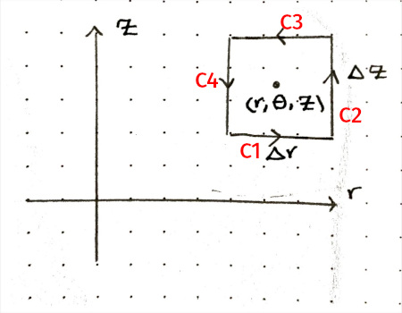

## Chapter 3 - Problems

**Problem III-1.**
Use an argument like the one given in the text for the Coloumb force to
show that $\int_C \mathbf{F} \cdot \hat{\mathbf{t}} \\, ds = 0$ is independent
of path for any central force $\mathbf{F}$.

:::expandable
**Solution.** [Click to Expand]

If $\mathbf{F}$ is a central force, then for any point $P$ in space, the force is in
the radial direction and its magnitude depends only on the distance $r$ from the origin:

$$
\mathbf{F} = F_r(r) \hat{\mathbf{r}}
$$

Then we have:

$$
\begin{align*}
F_x &= F_r(r) \sin \phi \cos \theta \\\\
F_y &= F_r(r) \sin \phi \sin \theta \\\\
F_z &= F_r(r) \cos \phi
\end{align*}
$$

and since:

$$
\begin{align*}
x &= r \sin \phi \cos \theta \\\\
y &= r \sin \phi \sin \theta \\\\
z &= r \cos \phi
\end{align*}
$$

We have:

$$
\begin{align*}
dx &= \sin \phi \cos \theta \\, dr + r \cos \phi \cos \theta \\, d\phi - r \sin \phi \sin \theta \\, d\theta \\\\
dy &= \sin \phi \sin \theta \\, dr + r \cos \phi \sin \theta \\, d\phi + r \sin \phi \cos \theta \\, d\theta \\\\
dz &= \cos \phi \\, dr - r \sin \phi \\, d\phi
\end{align*}
$$

Then:

$$
\begin{align*}
F_x \\, dx &+ F_y \\, dy + F_z \\, dz = \\\\
& F_r(r) (\sin^2 \phi \cos^2 \theta + \sin^2 \phi \sin^2 \theta + \cos^2 \phi) \\, dr + \\\\
& F_r(r) (r \sin \phi \cos \phi \cos^2 \theta + r \sin \phi \cos \phi \sin^2 \theta - r \sin \phi \cos \phi) \\, d\phi + \\\\
& F_r(r) (-r \sin^2 \phi \sin \theta \cos \theta + r \sin^2 \phi \sin \theta \cos \theta) \\, d\theta
\end{align*}
$$

Which simplifies to:

$$
F_x \\, dx + F_y \\, dy + F_z \\, dz = F_r(r) \\, dr
$$

On page 68 we saw that:

$$
\int_C \mathbf{F} \cdot \hat{\mathbf{t}} \\, ds = \int_C (F_x \\, dx + F_y \\, dy + F_z \\, dz) 
$$

Thus, we have:

$$
\begin{align*}
\int_C \mathbf{F} \cdot \hat{\mathbf{t}} \\, ds &= \int_C F_r(r) \\, dr \\\\
 &= \int_{r_1}^{r_2} F_r(r) \\, dr
\end{align*}
$$

which is independent of the path taken and depends only on the initial and final radius.

::::

---------------

**Problem III-2.**
In the text we obtained the result

$$
(\nabla \times \mathbf{F})_z = \frac{\partial F_y}{\partial x} - \frac{\partial F_x}{\partial y}
$$

by integrating over a small rectanglular path. As an example of the fact that this result
is independent of the path, rederive it, using a triangular path.

:::expandable
**Solution.** [Click to Expand]

 

Assume the force $\mathbf{F}$ is given by:

$$
\mathbf{F} = F_x \mathbf{i} + F_y \mathbf{j} + F_z \mathbf{k}
$$

In the text on page 68 we saw that:

$$
\int_C \mathbf{F} \cdot \hat{\mathbf{t}} \\, ds = \int_C (F_x \\, dx + F_y \\, dy + F_z \\, dz)
$$

Then for $C_1$, we have:

$$
\begin{align*}
\int_{C_1} \mathbf{F} \cdot \hat{\mathbf{t}} \\, ds &= \int_{y + \Delta y / 2}^{y - \Delta y / 2} F_y\left(x - \frac{\Delta x}{2} , u\right) \\, du
\\\\[1em]
& \approx -F_y\left(x - \frac{\Delta x}{2} , y\right) \Delta y
\end{align*}
$$

and for $C_2$, we have:

$$
\begin{align*}
\int_{C_2} \mathbf{F} \cdot \hat{\mathbf{t}} \\, ds &= \int_{x - \Delta x / 2}^{x + \Delta x / 2} F_x\left(u, y - \frac{\Delta y}{2}\right) \\, du
\\\\[1em]
& \approx F_x\left(x, y - \frac{\Delta y}{2}\right) \Delta x
\end{align*}
$$

and for $C_3$, we have:

$$
\begin{align*}
\int_{C_3} \mathbf{F} \cdot \hat{\mathbf{t}} \\, ds &= \int_{C_3} \left( F_x \, dx + F_y \\, dy \right) \\\\[1em]
&= \int_{x + \Delta x / 2}^{x - \Delta x / 2} F_x\left(u, y(u)\right) \\, du +
\int_{y - \Delta y / 2}^{y + \Delta y / 2} F_y\left(x(u), u\right) \\, du
\\\\[1em]
& \approx -F_x\left(x, y\right) \Delta x + F_y\left(x, y\right) \Delta y
\end{align*}
$$

Thus, we have:

$$
\begin{align*}
\int_{C_1+C_2+C_3} \mathbf{F} &\cdot \hat{\mathbf{t}} \\, ds \approx \\\\[0.5em]
&\Delta y \left( F_y(x, y) - F_y\left(x - \frac{\Delta x}{2}, y\right) \right) + \\\\[0.5em]
&\Delta x \left( F_x\left(x, y - \frac{\Delta y}{2}\right) - F_x(x, y) \right)
\end{align*}
$$

Since $\Delta A = \dfrac{\Delta x \Delta y}{2}$, we have:

$$
\begin{align*}
\frac{1}{\Delta A} \int_{C_1+C_2+C_3} \mathbf{F} &\cdot \hat{\mathbf{t}} \\, ds \approx \\\\[0.5em]
& \frac{F_y(x, y) - F_y\left(x - \frac{\Delta x}{2}, y\right)}
{\Delta x / 2} - \\\\[0.5em]
&\frac{F_x(x, y) - F_x\left(x, y - \frac{\Delta y}{2}\right)}{\Delta y / 2}
\end{align*}
$$

So, we have:

$$
\lim_{\Delta A \to 0} \frac{1}{\Delta A} \int_{C_1+C_2+C_3} \mathbf{F} \cdot \hat{\mathbf{t}} \\, ds =
\frac{\partial F_y}{\partial x} - \frac{\partial F_x}{\partial y}
$$
::::

---------------

**Problem III-7.** Show that $\nabla \cdot (\nabla \times \mathbf{F}) = 0$. (Assume that
mixed second partial derivatives are independent of the order of differentiation.)

:::expandable
**Solution.** [Click to Expand]

$$
\begin{align*}
\nabla \times \mathbf{F} &= \mathbf{i} \left( \frac{\partial F_z}{\partial y} - \frac{\partial F_y}{\partial z} \right) \\\\
&+ \mathbf{j} \left( \frac{\partial F_x}{\partial z} - \frac{\partial F_z}{\partial x} \right) \\\\
&+ \mathbf{k} \left( \frac{\partial F_y}{\partial x} - \frac{\partial F_x}{\partial y} \right)
\end{align*}
$$

Then:

$$
\begin{align*}
\nabla \cdot (\nabla \times \mathbf{F}) &= \frac{\partial F_z}{\partial x \partial y} -
\frac{\partial F_y}{\partial x \partial z} \\\\
&+ \frac{\partial F_x}{\partial y \partial z} - \frac{\partial F_z}{\partial x \partial y} \\\\
&+ \frac{\partial F_y}{\partial x \partial z} - \frac{\partial F_x}{\partial y \partial z} \\\\
&= 0
\end{align*}
$$
::::

---------------

**Problem III-8.** In the text we obtained the $z$-component of $\nabla \times \mathbf{F}$ 
in cylindrical coordinates. Proceeding the same way, obtain the $\theta$- and $r$-components.

:::expandable
**Solution ($\theta$-component).** [Click to Expand]

Using the path shown in the figure, we'll yield the $\theta$-component of $\nabla \times \mathbf{F}$ in cylindrical coordinates.

 

Viewed from above:

 

For $C_1$, we have $\hat{\mathbf{t}} = \hat{\mathbf{e}_r}$ and $ds = dr$. Then:

$$
\begin{align*}
\int_{C_1} \mathbf{F} \cdot \hat{\mathbf{t}} \\, ds &= \int_{r - \Delta r / 2}^{r + \Delta r / 2} F_r(u, \theta, z - \frac{\Delta z}{2}) \\, du \\\\[1em]
&\approx F_r(r, \theta, z - \frac{\Delta z}{2}) \Delta r
\end{align*}
$$

For $C_2$, we have $\hat{\mathbf{t}} = \mathbf{\mathbf{e}_z}$ and $ds = dz$. Then:

$$
\begin{align*}
\int_{C_2} \mathbf{F} \cdot \hat{\mathbf{t}} \\, ds &= \int_{z - \Delta z / 2}^{z + \Delta z / 2} F_z(r + \Delta r / 2, \theta, u) \\, du \\\\[1em]
&\approx F_z(r + \frac{\Delta r}{2}, \theta, z) \Delta z
\end{align*}
$$

For $C_3$, we have $\hat{\mathbf{t}} = -\hat{\mathbf{e}_r}$ and $ds = -dr$. Then:

$$
\begin{align*}
\int_{C_3} \mathbf{F} \cdot \hat{\mathbf{t}} \\, ds &= \int_{r + \Delta r / 2}^{r - \Delta r / 2} (-F_r(u, \theta, z + \frac{\Delta z}{2})) \\, (-du) \\\\[1em]
&\approx -F_r(r, \theta, z + \frac{\Delta z}{2}) \Delta r
\end{align*}
$$

For $C_4$, we have $\hat{\mathbf{t}} = -\hat{\mathbf{e}_z}$ and $ds = -dz$. Then:

$$
\begin{align*}
\int_{C_4} \mathbf{F} \cdot \hat{\mathbf{t}} \\, ds &= \int_{z + \Delta z / 2}^{z - \Delta z / 2} (-F_z(r - \Delta r / 2, \theta, u)) \\, (-du) \\\\[1em]
&\approx -F_z(r - \frac{\Delta r}{2}, \theta, z) \Delta z
\end{align*}
$$

Then, we have:

$$
\begin{align*}
\int_{C_1 + C_2 + C_3 + C_4} \mathbf{F} &\cdot \hat{\mathbf{t}} \\, ds \approx \\\\[0.5em]
&\Delta r \left( F_r(r, \theta, z - \frac{\Delta z}{2}) - F_r(r, \theta, z + \frac{\Delta z}{2}) \right) + \\\\[0.5em]
&\Delta z \left( F_z(r + \frac{\Delta r}{2}, \theta, z) - F_z(r - \frac{\Delta r}{2}, \theta, z) \right)
\end{align*}
$$

Since $\Delta A = \Delta r \Delta z$, we have:

$$
\begin{align*}
\frac{1}{\Delta A} \int_{C_1 + C_2 + C_3 + C_4} \mathbf{F} &\cdot \hat{\mathbf{t}} \\, ds \approx \\\\[0.5em]
& \frac{F_r(r, \theta, z - \dfrac{\Delta z}{2}) - F_r(r, \theta, z + \dfrac{\Delta z}{2})}
{\Delta z} - \\\\[0.5em]
&\frac{F_z(r + \dfrac{\Delta r}{2}, \theta, z) - F_z(r - \dfrac{\Delta r}{2}, \theta, z)}{\Delta r}
\end{align*}
$$

So, $\theta$-component of $\nabla \times \mathbf{F}$ is:

$$
\lim_{\Delta A \to 0} \frac{1}{\Delta A} \int_{C_1 + C_2 + C_3 + C_4} \mathbf{F} \cdot \hat{\mathbf{t}} \\, ds =
\frac{\partial F_r}{\partial z} - \frac{\partial F_z}{\partial r}
$$

::::

:::expandable
**Solution ($r$-component).** [Click to Expand]

::::