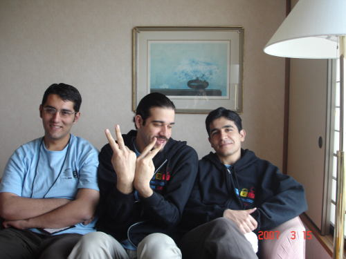
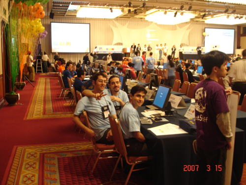
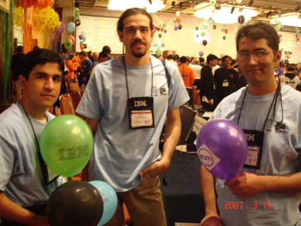

قبل از مسابقه همه خندان بودیم (من عینکیه هستم):

صبح زود بیدار شدیم، صبحانه خوردیم، و آماده شدیم که به محل مسابقه وارد شویم. رضا badge اش را درست نبسته بود، برای همین Bill Poucher مجبورش کرد چند حرکت شنا انجام بدهد و کلی خندیدیم.

و بالاخره مسابقه آغاز شد:

 

**دقیقه ی ۱:**
 حسین سوال A، من سوال B، و رضا سوال C را خواند. سوال A آسان بود، ولی من هنوز سوال B را درست نفهمیده بودم. حسین سوال A را به ما توضیح داد و تصمیم گرفتیم که به عنوان اولین سوال، سوال A را بنویسیم.
 

**دقیقه ی ۲۰:**
 تیم های زیادی سوال B را گرفته اند، رضا سوال B را دوباره خوانده و برای من توضیح داده. هنوز هیچ ایده ای نداریم.

**دقیقه ی ۵۰:**
 حسین کد سوال A را تمام کرد و پس از کمی تست Submit می کنیم. هنوز هیچ ایده‌ای برای سوال B نداریم. سوال B را برای حسین نیز توضیح می‌دهیم.

**دقیقه ی ۵۱:**
 جواب Submit مون Wrong Answer شد. کمی کد را می‌خوانیم و به مشکل پی می‌بریم.

**دقیقه ی ۶۷:**
 سوال A را دوباره Submit می‌کنیم. این دفعه جواب Submit مون Yes شد.

**دقیقه ی ۷۰:**
 هر سه روی B فکر می‌کنیم. ایده های زیادی مطرح می شود ولی چون مطمئن نیستیم بیشتر فکر می‌کنیم.

 
**دقیقه ی ۹۰:**
 بالاخره بر سر ایده‌ی سوال B توافق می کنیم. شروع می‌کنم به نوشتن کدش.

 

**دقیقه ی ۱۰۰:**
سوال B را Submit می کنیم و جوابش Yes می‌شود. حسین سوال G را می‌خواند و توضیح می‌دهد. به نظر آسان می‌آید. بر سر پیاده‌سازی اش توافق می کنیم وشروع می‌کنم به پیاده سازی جواب.

 

**دقیقه ی ۱۳۰:**
 اولین Wrong Answer برای سوال G را می‌گیریم. کد را می خوانیم و دو باگ در می‌آوریم، درستش می‌کنیم و دوباره Submit می‌کنیم.

 

**دقیقه ی ۱۴۵:**
 دومین Wrong Answer را می گیریم. کد را n بار می‌خوانیم. هیچ مشکلی پیدا نمی‌کنیم … صورت سوال را چند بار می‌خوانیم …  یک قسمتش برای‌مان مبهم است. با یک فرض دیگر یک کد دیگر می‌نویسیم و Submit می کنیم.

 

**دقیقه ی ۱۶۰:**
 سومین Wrong Answer را می‌گیریم. رضا صورت سوال را دوباره می‌خواند و سر یک جمله گیر می‌دهد. بالاخره نظر رضا را قبول می‌کنیم و آن برداشت یک کد دیگر می‌زنیم.

 

**دقیقه ی ۲۰۰:**
 این دفعه Runtime Error می‌گیریم. نمی‌دانیم چه کار کنیم.

 

**دقیقه ی ۲۴۳:**
 من شروع می‌کنم به زدن کد سوال C. بابک به‌ساز بسیار نگران به ما نگاه می‌کند.

 

**دقیقه ی ۲۶۰:**
 حسین صورت سوال را دوباره می‌خواند، یک نکته‌ی دیگر پیدا می‌کند … شروع می‌کند و درست کردن کد.

 

**دقیقه ی ۲۸۰:**
 بالاخره سوال G را Submit می کنیم و Yes می‌گیریم. من بقیه‌ی کد C را می‌زنم.

 

**دقیقه ی ۲۹۰:**
 سوال C را Submit می کنیم و Wrong Answer می‌گیریم. رضا یک حالت خاص را توضیح می‌دهد و من شروع می‌کنم به درست کردن کد.

 

**دقیقه ی ۲۹۶:**
 سوال C را Submit می‌کنیم و Yes می‌گیریم. بابک به‌ساز از حالت نگرانی شدید به وضع عادی بر می‌گردد. ۴ دقیقه ی آخر را حرف می زنیم.

 

**دقیقه ی ۳۰۰:**
 مسابقه تمام شد.

 و بالاخره در Awards Ceremony معلوم می‌شود که تیم دانشگاه Warsaw قهرمان امسال شده. 

--------

بدعمل کردیم زیرا: اگر سر سوال G بد عمل نمی کردیم و یک ساعته تمامش میکردیم، می‌توانستیم حداقل یکی از دو سوال F که سوال متوسط به پائینی بود و سوال D که نیاز به دانستن قضیه ی Pick داشت و ما دانش کافی برای حل آن را داشتیم را حل کنیم و وضع مان از این خیلی بهتر باشد.

 

می‌توان راضی بود زیرا: در ۲۰ دقیقه ی آخر دو سوال گرفتیم و از وضعیت افتضاح به وضعیت متوسط رسیدیم. و چون یک سال دیگر وقت داریم.

 

در قدم اول برای سال بعد، فعلا تصمیم دارم در تعطیلات سال نو topcode rating ام را (در سه مسابقه) به بالای ۲۲۰۰ (فعلا ۲۰۴۰ هستم) برسانم. 
